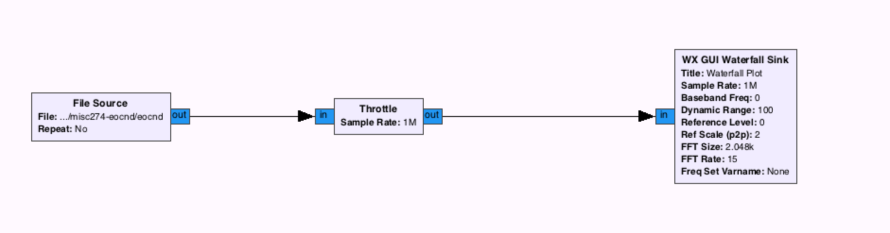
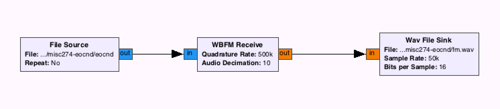

## eocnd - Misc 274 Problem - Writeup by Robert Xiao (@nneonneo)

In this problem we were given a 3.7 GB binary file. Looking at the file in a hex editor, it's clear that the data consists of 8-byte chunks (as patterns emerge every 8 bytes), and a bit of trial-and-error shows that each chunk is two floating-point values in little-endian 32-bit float format.

One of the posted hints is a link to a video of the band Radiohead. We therefore guessed that the problem had something to do with radio transmission. Radio transmissions are commonly represented as streams of complex numbers (also known as "IQ", for the In-phase and Quadrature components of the signal), so it's pretty clear that we're dealing with a file full of complex numbers.

The open-source GNU Radio project is a great tool to explore this kind of raw data. It's very easy to whip up a flow graph to visualize this data:

>

When we run this graph we get a waterfall plot which clearly shows a single frequency peak moving rapidly around in a narrow range. This is very indicative of [frequency modulation](https://en.wikipedia.org/wiki/Frequency_modulation), a.k.a. FM radio.

Thus, we constructed a flow graph to decode the FM radio:

>

After running this flow graph, we opened the resulting `fm.wav` file and were greeted with some kind of audible signal of very low frequency, as we had only guessed the FM sampling frequency. Speeding up the audio revealed that it was the famous song "Gangnam Style", which gave everybody playing a good surprise :)

The flag, therefore, is simply `gangnamstyle`.
