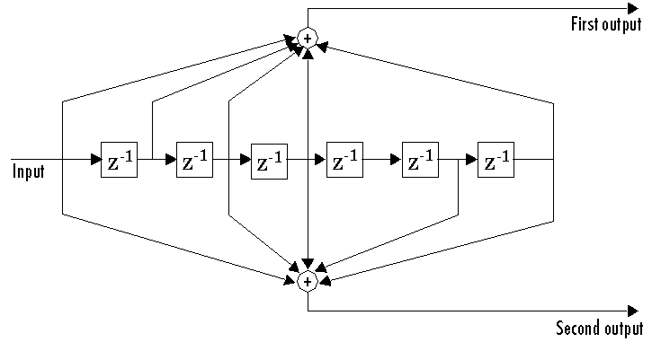

## Double? Half!

We are provided with a binary file and asked to provide the MD5SUM of the result as a flag. Thankfully, two very helpful hints were eventually given:

 - 133171
 - Shift Register

With these hints, it was obvious that the binary file was the result of a 1/2 rate convolutional code with K=7 and fairly standard parameters (0133, 0171).  



Typically, a viterbi decoder is used to decode a convolutional code. This is unnecessary if the code has no errors, and instead we can trivially derive the input bit from every two output bits.

We started with implementing an encoder:

```
r = 0
for c in data:
    x = ord(c)
    for b in ('0' * 8+ bin(x)[2:])[-8:]:
        r = ((0 if b == '0' else 1) << 6) | (r >> 1)
        o1 = bin(r & 0133).count('1') & 1
        o2 = bin(r & 0171).count('1') & 1
        print o1
        print o2
```

Now, to build a simple decoder, we can ask the question: what must the input bit be to give us the known output bits? Specifically, we calculate the parity assuming the input bit is 0. If the parity is correct, then it will match the output bits. If not, then the input bit must have been a 1.

```
r = 0
while True:
    s = ''
    try:
        for _ in xrange(1024):
            x = struct.unpack('>H', f.read(2))[0]
            bits = ('0' * 16 + bin(x)[2:])[-16:]
            ch = 0
            for y in xrange(8):
                r = r >> 1
                p1 = bin(r & 0133).count('1') & 1
                p2 = bin(r & 0171).count('1') & 1
                o1, o2 = bits[y*2:y*2+2]
                if p1 == 1 and o1 == '1' or p1 == 0 and o1 == '0':
                    assert p2 == int(o2)
                    ch = ch << 1
                else:
                    assert p2 != int(o2)
                    r |= 1 << 6
                    ch = (ch << 1) | 1
            s += chr(ch)
    except:
        sys.stdout.write(s)
        sys.exit(0)
    sys.stdout.write(s)
```

The result is a WAV file. We take the MD5SUM to get the flag: ```959399da27ed21c1d971fca4156f75ab```.
