# n<sup>3</sup>&emsp;<sub><sup>Misc, 955 points</sup></sub>

_Writeup by [@bluepichu](https://github.com/bluepichu)_

> Network security matter!

The handout for this problem is an ONNX execution graph.  For those unfamiliar, ONNX is a format for representing ML models in a standardized graph format for better interoperability between tooling.

I've had some experience before debugging misbehaving ONNX-formatted ML models, and immediately remembered a very convenient tool, [Netron](https://netron.app/), for inspecting ONNX files.  Loading the handout into Netron, we saw that the entire graph consists of a series of checks, all of which presumably need to succeed in order for our input to be accepted.

To start, we took a look at the entrypoint graph:

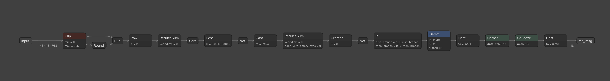

The first helpful piece of information is the expected input size: 1x3x48x768.  Based on the runner, this means that our input should be a single RGB image with dimensions 768x48.

The logic encoded by the rest of the graph can be summarized by the following:

```
rounded_input = round(input) # element-wise
deltas = rounded_input - input # element-wise
net_delta = sqrt(sum(deltas ** 2))
if net_delta >= 0.001:
	fail
else:
	go to next level
```

In other words, our inputs should all be roughly integers.  This makes sense since they'll be pixel channel values.  Using the tool to navigate to `if_0_then_branch`, we moved to the next level:

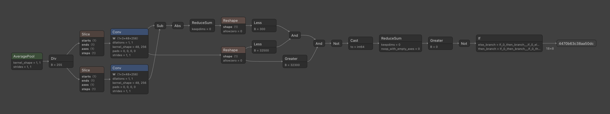

An important note about the convolution steps here is that they're effectively being used as a dot product between the input tensor and the fixed `W` tensors rather than a proper convolution, because in both cases the `W` tensor has the same input shape as the input and there is no padding.

Netron can also be used to dump the actual values of the `W` tensors by selecting the nodes in the graph and clicking the download button, which conveniently gives us a numpy array of the weights.  Using this, we found that the top convolution is a tensor consisting of all 1s, while the bottom tensor is mostly 1s but has some other data as well (more on that in a second).

The logic of this section can be summarized as:

```
W_1 = (weight tensor from Conv)
slice_1 = normalize(input[:, :, :, :256], 0, 1) # i.e. remap to [0, 1]

conv_top = sum(slice_1)
conv_bottom = dot(slice_1, W_1)

if abs(conv_top - conv_bottom) < 300 and 32300 < conv_top < 32500:
	go to next level
else:
	fail
```

Or, in words: the input slice needs to have a sum between 32300 and 32500, but have a dot product with `W_1` almost equal to its sum.  Since there this slice is 3x48x256 for a total of 36864 pixel-channels, this means that the expected image in this area needs to be mostly white with just a little bit of black, and based on the input restrictions means that it has to almost perfectly match `W_1`.  This sounds like it's probably going to be text with a mask specified by `W_1`, and visualizing `W_1` as an image confirms this:

```py
W_1 = np.load("W_1.npy")
part1 = W_1
part1_img = (part1 * 255).astype(np.int8).squeeze(0).transpose(1, 2, 0)
Image.fromarray(part1_img, "RGB").save("part1.png")
```

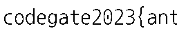

So we had the first third of the flag!  This also told us that the rest of the image will probably be black text on white as well, which was useful to keep in mind for the rest of it.

The next level looks like this:

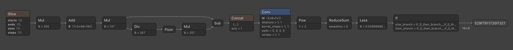

In pseudocode:

```
offset_2 = (weight tensor from Add)
tgt_2 = (weight tensor from Concat)
W_2 = (weight tensor from Conv)

slice_2 = normalize(input[:, :, :, 256:448], 0, 255)

# simplified from the Mul -> Div -> Floor -> Mul -> Sub chain
remapped = ((slice_2 + offset_2) * 137) % 257

concatted = concat(remapped, tgt_2, axis=1)
if sum(conv(concatted, W_2) ** 2) < 0.001:
	go to next level
else:
	fail
```

Of course, in order to evaluate our next step, we needed to understand the convolution being applied.  The weight tensor `W_2` looks like this:

```
[
	[
		[[1]],
		[[0]],
		[[0]],
		[[-1]],
		[[0]],
		[[0]]
	],
	[
		[[0]],
		[[1]],
		[[0]],
		[[0]],
		[[-1]],
		[[0]]
	],
	[
		[[0]],
		[[0]],
		[[1]],
		[[0]],
		[[0]],
		[[-1]]
	]
]
```

The first dimension in the `Conv` operation is the number of different convolution maps we're going to apply, so this is actually wrapping up three convolutions in one operation.  The first convolution is computing the difference between channels 0 and 3, the second between 1 and 4, and the third between 2 and 5.  Since channels 0-2 are the color channels from our remapped input and channels 3-5 are the values in the `tgt_2` tensor, and we're then expecting the sum of the squares of these differences to be small, this means that our input needs to be selected such that after the remapping process it is equal to (or very close to) `tgt_2`.

Reversing the remapping operation was simple enough:

```py
offset_2 = np.load("offset_2.npy")
tgt_2 = np.load("tgt_2.npy")

fwd = [x * 137 % 257 for x in range(257)]
bwd = [0]*257
for i in range(257):
    bwd[fwd[i]] = i

part2 = (np.vectorize(lambda x: bwd[int(x)])(tgt_2) - offset_2) % 257 / 255
part2_img = (part2 * 255).astype(np.int8).squeeze(0).transpose(1, 2, 0)
Image.fromarray(part2_img, "RGB").save("part2.png")
```

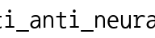

So now we had the second part of the flag!  This one was a little smaller than the first, but we can at least see that they fit together as expected.

The next level looks like this:

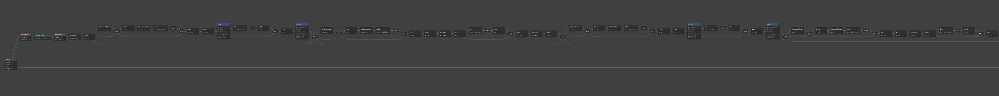
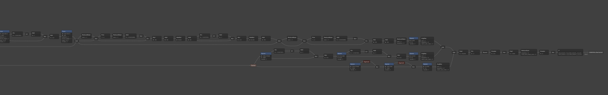

_Yikes._

A cursory inspection of this level suggested that it was likely actually a model trained to recognize the next slice of the image (colums 448 to 640).  There were a large number of matrix multiplies like you'd see in the layers of a deep neural net, and their weight values didn't follow an obvious pattern.  The sigmoid functions also suggested neuron activatiions, though the fact that they were only in one branch was a bit interesting.

As we knew there was only one more level to the graph, we decided to skip ahead to it, especially since this slice only had 192 pixels of content that would be potentially guessable if we could recover the rest of the flag.

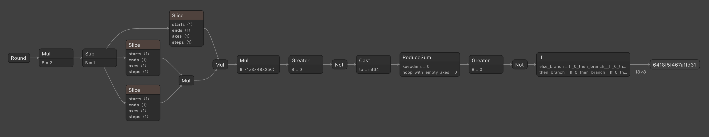

This was a lot more approachable.  The pseudocode for this level is:

```
W_4 = (weight tensor from Mul)
centered_input = normalize(input, -1, 1)

centered_1 = centered_input[:, :, :, 0:256]
centered_2 = centered_input[:, :, :, 256:512]
centered_3 = centered_input[:, :, :, 512:768]
product = centered_1 * centered_2 * centered_3 * W_4 # element-wise multiplication

if all elements of product are <= 0:
	pass
else:
	fail
```

Since the multiplications are all element-wise and we already have columns 0 to 448, we can get the beginning of the third slice by dividing out the information we already have:

```py
W_4 = np.load("W_4.npy")

part1_centered = part1 * 2 - 1
part2_centered = part2 * 2 - 1
part4a_centered = W_4[:, :, :, :part2_centered.shape[3]] / part1_centered[:, :, :, :part2_centered.shape[3]] / part2_centered

part4a = (part4a_centered + 1) / 2
part4a_img = (part4a * 255).astype(np.int8).squeeze(0).transpose(1, 2, 0)
Image.fromarray(part4a_img, "RGB").save("part4a.png")
```

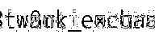

This was a bit messy due to some artifacts from antialiasing, but was still readable.  We then tried seeing what would happen if we tried to divide out the remainder of the flag, for which we didn't have part 3:

```
part4b_mangled_centered = W_4[:, :, :, part2_centered.shape[3]:] / part1_centered[:, :, :, part2_centered.shape[3]:]

part4b_mangled = (part4b_mangled_centered + 1) / 2
part4b_mangled_img = (part4b_mangled * 255).astype(np.int8).squeeze(0).transpose(1, 2, 0)
Image.fromarray(part4b_mangled_img, "RGB").save("part4b_mangled.png")
```

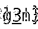

This is definitely readable enough to extract the missing characters from the flag given the context of the parts of the flag we do know, giving us the full flag:


```
codegate2023{anti_anti_neural_n3tw0rk_exchang3!}
```

The logic for why this last step worked is pretty straightforward: suppose that the entire flag was exactly black or white with no antialising; then the "centered" tensors would have a value of -1 where it's black, and 1 where it's white.  This would mean that element-wise multiplication is the same operation as XOR, with black being true and white being false.  Thus, for this final segment, the missing image just contained the XOR of the two parts of the flag we were missing, which is sufficiently readable.

In fact, I actually hypothesize that a sufficently-motivated CTFer could probably get a flag with only `W_4` as context, given that `codegate2023{` and `}` are already known as part of the flag format:

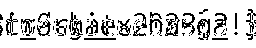
