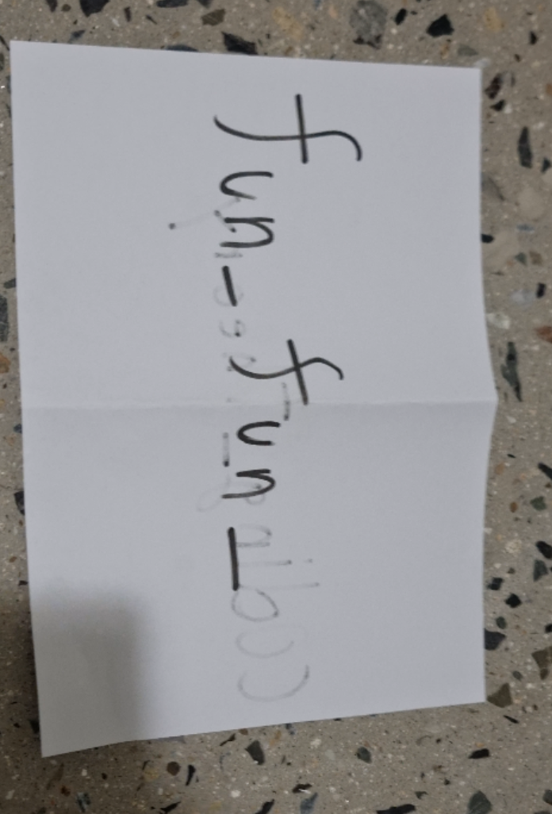
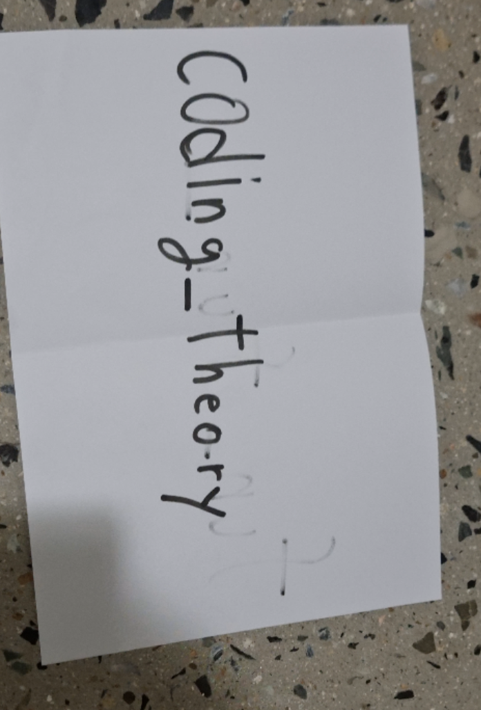
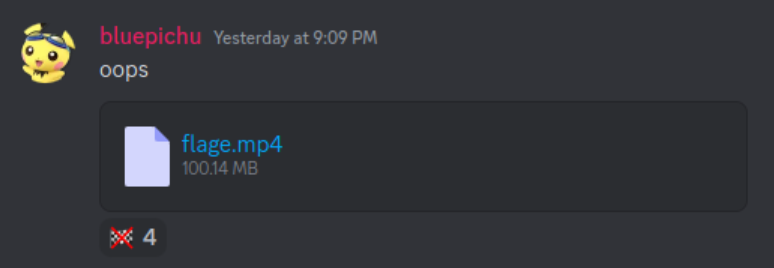

# Everlasting_Message - Rev, 250 points (26 solves)

_Writeup by [@babaisflag](https://github.com/babaisflag)_

*We did not solve this in time, but 10 minutes after the end of the contest.* 😭

Description:

>This binary won't stop sending messages. It seems to be trying to tell us something important...
>
>([BGM](https://www.youtube.com/watch?v=5leVql3RVnA))
>
>\* Flag is `codegate2024{[found_string]}`.
>
>```sh
>$ sha256sum ./messages 
>0356d4c29863d2c7111635c28db23790a229be56676880857d107b1076284dc3 ./messages
>$ sha256sum ./flag_enc 
>34146e91b149fa6474e8cc2a3348329d23ed76d4b9b6611c78a2f16c2684a673 ./flag_enc
>```
>
>file link: https://drive.google.com/file/d/1xvj706eiPD7RQ3gatCHM_mfQ8wqNblS5/view?usp=sharing

We're provided with a `messages` Linux binary and a `flag_enc` data.

## Reversing

`messages` takes a file and outputs a mangled file. It divides the input data into 80 bit chunks and processes each chunk with 4 worker threads. The main thread and the 4 worker threads communicate via [System V IPC](https://docs.oracle.com/cd/E19683-01/816-5042/6mb7bck67/index.html) - the main thread does the splitting of the input bytes into chunks, sends it to the threads, then receives the output from the threads to combine and write to disk.

Each thread (we'll identify them with id's 1~4 for convenience) has a struct associated with them:

```c
struct thread_ctx {
    int64_t id;
    void* get_5_nibbbles;
    void* fn_mangle;
};
```

`get_5_nibbles` is a function pointer that gets 5 nibbles (20 bits) from the 80-bit chunk - thread 1 will get the lowest 20 bits, thread 2 the next 20, and so on. `fn_mangle` is the mangling function associated with each thread. They all do similar things, with differing constants: they take the 20 bit input and produce a 40 bit ouput, where each bit of the output is `xor` of some combination of input bits. The array of `thread_ctx` structs is located at `DAT_00109020`.

The worker thread function receives the 80 bits from the main thread, takes its 20 bit chunk with `get_5_nibbles`, and does the mangling with `fn_mangle`. Then, it flips up to 2 bits of the output at random. We initially thought the `rand()` might be exploitable due to it not being seeded, but because `rand()` is not thread safe, it was in effect random.

## Solving

Some attempts were made in solving this problem:

- Bruteforce 80 bit chunks at a time
- `fn_mangle` as matrix multiplication, use the matrix inverse

Bruteforcing at least gave a readable header: `b'\x00\x00\x00\x18ftypmp42\x00\x00\x00\x00isommp42\x00\x00\x00\x01mdat\x00\x00\x
00\x00\x0611\x1c!\x1b\x888\x00\x0f\xff\xfe\x0f\xf7'`

So it was a MP4 video, which makes sense given the size of the output. However, at this point we only had about 1 hour left and needed to come up with a faster way (both for implementing and executing).

The idea was that since the mangling function takes an input of 20 bits and outputs 40 bits with 1 to 1 mapping, there are only 2^20 (~1 million) pairs; up to 2 random bit flips of the output is 40 C 0 + 40 C 1 + 40 C 2 possible outputs, which is around 800, and since we have the output, we can try all the possible bit flips for each 40 bits of the outputs.

With only 4 functions that's straight forward, we slapped the decompiled function and cleaned it up to make it python, then made the result of inputting `0` to `0xfffff` to the functions into dictionaries, the keys being the output of the functions and the values being the inputs ([`invfuncs.py`](invfuncs.py)). Then we just tried all combinations of bitflips on each 20 bit chunks until there was a match - one of them will have a match in the dictionary. The results were concatenated to form a video ([`sol.py`](sol.py)).

`python3 invfuncs.py` creatses a pickle of the inverse function dictionary, `invfunc`. `python3 sol.py 0 20778620` runs the bruteforce in 15 cores (took about 30 minutes to run), and produces a `maybe_flage_000000000`, which is an mp4 video. The video contains the flag string:




`codegate2024{fun_fun_coding_theory}`

## An Issue of Skill

We had about 40 minutes left when we started running the initial script; to our dismay, it was not going to make it in time. Since running it in 15 cores on my laptop wasn't enough, we decided to parallelize, by running the script in everyone's laptops and running them in separate chunks of inputs. We chunked them into `10000000` bytes, which would be 21 chunks. In retrospect, we might have made it in time if we had played perfectly, but we made several silly mistakes, such as:

- running it in single core
- me being bad at coding
- not having 128 cores
- not all of us having discord nitro, resulting in upload limit
- not padding output file numbers so `cat maybe_flage_* > flage.mp4` concatenated part 0, part 1, part 10, part 11, etc.

We collectively started running the script at 8:50 pm EDT, and the final part was done at 9:02 pm. `cat` didn't work because of the said problem with not padding output file numbering, and after rerunning a part and figuring out the problem, we had the video at 9:09 pm:



## Credits

- [me](https://github.com/babaisflag): reversing, ideas, scripting, being an IDE, more core, and writeup
- [@5w1min](https://github.com/mhsuab): reversing, ideas, scripting, debugging, and more core
- [@bluepichu](https://github.com/bluepichu): ideas, scripting, debugging, and more core
- @kos, @Venax: more core