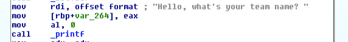
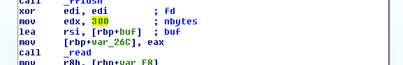
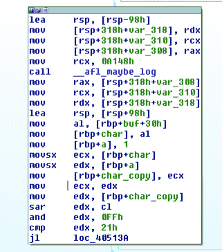
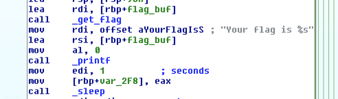
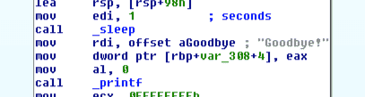

# Fuckzing reverse Writeup
### EKOPARTY 2016 – rev250

## Overview
This challenge is a bit different than other reversing challenges. Instead of guessing the flag and the program accepting or rejecting it, you send your guess to the server (running the program) and if your input is correct it outputs the flag. The only practical difference here is that we need to generate the correct input locally and send the input to the server to receive the flag.

## Binary Investigation

As usual, we run `file` on the program to find what we are dealing with.

``` bash
$ file FUck_binary
FUck_binary: ELF 64-bit LSB executable, x86-64, version 1 (SYSV), dynamically linked, interpreter /lib64/ld-linux-x86-64.so.2, for GNU/Linux 2.6.32, BuildID[sha1]=583997ea22be0b90670780cb91b36de37e1100d2, not stripped
```

Throwing the binary into IDA, we are greeted with *this* graph view.


Ouch.

At the beginning of the program we are asked to input a team name:



Then, the program reads in 300 bytes of our input:



Following this, there are one hundred discrete checks on the user input. All the ones that I looked had did simple bitwise operations such as xor-ing, rolling, etc. For example, the following snippet checks the 0x30th character of the input (`buf[0x30] >> 1 & 256 == 0x21`).



If all of these checks pass, the server prints out the flag by calling the `get_flag` function from a shared library (this part is in the exact center of the graph view). Since we don't have access to this library, we are reliant on the server to receive the flag.



If any one of the checks fail, the execution diverges to the second half of the graph view, in a position corresponding to where it failed (i.e. if it failed the first check, it jumps to the first block in the second half). Finally, given any input the program outputs "Goodbye!"



## Satisfying the Constraints

While there are no subroutines called in all of this, I didn't want to spend the whole day reversing and solving each constraint. The presence of `afl` (and the name of the challenge) suggests that we can use [AFL](http://lcamtuf.coredump.cx/afl/) to fuzz for a satisfying input.

However, the linear nature of the program, lack of loops, clear goal, and precise constraints makes this a suitable job for [angr](http://angr.io).

For those uninitiated, angr is a symbolic execution engine. This basically means that it can reduce a program to an SMT equations and can calculate inputs to get to parts of the program (even with additional user defined constraints). The lack of looping means we don't have to deal with path explosion and the precise input constraints yield for simple SMT equations.

## Using angr

First, we need to define the addresses of the program where want to start, find, and avoid. You can start wherever you want, but it can require you to do more setup if you don't start at the beginning. The addresses to avoid are the places where the execution jumped if a check failed – they happened to be regular. Additionally, we need to create the starting state of the program.

``` python
import angr  

START = 0x400B30
FIND = 0x403A40
AVOID = [0x403A7E + i * 60 for i in range(100)]

p = angr.Project('FUck_binary')
state = p.factory.blank_state(addr=START)
```

Next, we need to add constraints on stdin since we are reading from it for input. If we started execution later in the program, we would have had to constrain the memory where the input was read to. These constraints help to limit angr's search space and speed up solve time.

``` python
def char(state, c):
    return state.se.And(c <= '~', c >= ' ')  

for i in range(100):
    c = state.posix.files[0].read_from(1)
    state.se.add(char(state, c))  

state.posix.files[0].seek(0)
state.posix.files[0].length = 100
```

Now that we've constrained the input, we just need to create an execution path from our addresses and let angr run.

``` python
path = p.factory.path(state)
ex = p.surveyors.Explorer(start=path, find=FIND, avoid=AVOID)
ex.run()
```

In around thirty seconds, angr was able to find a satisfying input.

``` python
>>> ex.found[0].state.posix.dumps(0)
'@@@(h@@@@f@v@ @@/@vCo@&D@ACHP@@@@@@@@D@@ @X@@@@@B@h@]@@@W@UB@"(@Lq@@@@@,FBtH@?6@@" * k[Q@@@@@@@@@I@@\x00\x00\x00\x00\x00\x00\x00\x00\x00\x00\x00\x00\x00\x00\x00\x00\x00\x00\x00\x00\x00\x00\x00\x00\x00\x00\x00\x00\x00\x00\x00\x00\x00\x00\x00\x00\x00\x00\x00\x00\x00\x00\x00\x00\x00\x00\x00\x00\x00\x00\x00\x00\x00\x00\x00\x00\x00\x00\x00\x00\x00\x00\x00\x00\x00\x00\x00\x00\x00\x00\x00\x00\x00\x00\x00\x00\x00\x00\x00\x00\x00\x00\x00\x00\x00\x00\x00\x00\x00\x00\x00\x00\x00\x00\x00\x00\x00\x00\x00\x00\x00\x00\x00\x00\x00\x00\x00\x00\x00\x00\x00\x00\x00\x00\x00\x00\x00\x00\x00\x00\x00\x00\x00\x00\x00\x00\x00\x00\x00\x00\x00\x00\x00\x00\x00\x00\x00\x00\x00\x00\x00\x00\x00\x00\x00\x00\x00\x00\x00\x00\x00\x00\x00\x00\x00\x00\x00\x00\x00\x00\x00\x00\x00\x00\x00\x00\x00\x00\x00\x00\x00\x00\x00\x00\x00\x00\x00\x00\x00\x00\x00\x00\x00\x00\x00\x00\x00\x00\x00\x00\x00\x00\x00\x00\x00\x00\x00\x00\x00\x00'
```

Trimming the trailing null bytes, we find that the correct input is '@@@(h@@@@f@v@ @@/@vCo@&D@ACHP@@@@@@@@D@@ @X@@@@@B@h@]@@@W@UB@"(@Lq@@@@@,FBtH@?6@@" * k[Q@@@@@@@@@I@@'. When we send this to the server, it sends back 'Your flag is EKO{}' with a string of random hex characters inside the braces that is different every time.

# Downloads
[FUck_binary](FUck_binary)  
[solve.py](solve.py)