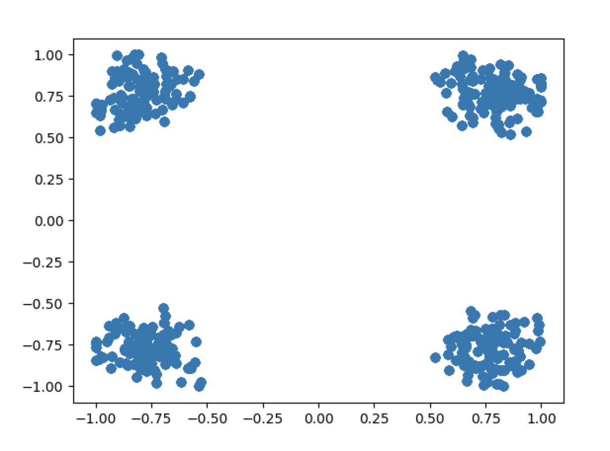

## Communication Systems - Phasors to Kill - 245 points (9 solves)

_Writeup by: Robert Xiao (@nneonneo)_

### Background

> Stunned you figured out that first SDR capture? Time to hack harder to get this flag.

We're given a single WAV file, with a sampling rate of 44100 Hz, two channels, 28928 samples long.

### Solution

The given file has two channels, both of which are signals that look like bits of sine waves pasted together. Clearly, it's some kind of data modulated onto sine waves. From the name of the challenge (Phasors) we can guess it's phase-based encoding (probably phase-shift keying given the abrupt changes in phase), with the two WAV channels representing the I (real) and Q (complex) components of the signal.

Plotting the instantaneous I/Q positions across the signal (a constellation diagram) shows four hotspots, suggesting QPSK modulation. The standard way to demodulate this signal would be to use GNURadio and the (excellent) PSK demodulator block to extract out the result. However, I've recently been playing around with some signal processing techniques in pure Python, so I felt like solving this challenge a bit more manually.

Luckily, the signal is extremely well-behaved (it seems to be generated by a computer and has zero noise): by plotting every 4th sample, I can see a very clear constellation diagram with four tightly spaced points, which makes extracting a signal easy:

> 

I simply grab every 4th sample, compute the instantaneous phase (the angle of the I/Q sample), and bucket the phase based on its quadrant. I played around with different decodings of the phase angle, and eventually discovered that differential PSK (using the difference between successive phases as the raw value) and Gray code encoding (decoding differences into bits using a Gray code, i.e. `0, 1, 3, 2`) produced meaningful output.

The full solve script can be found in [solve.py](solve.py). Put it in the same directory as `challenge.wav` and run the script under Python 3; it requires the NumPy, SciPy and Matplotlib dependencies.
