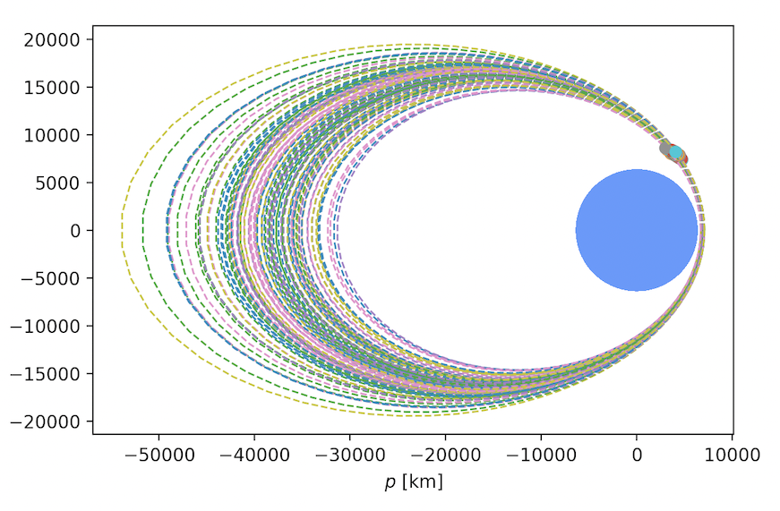
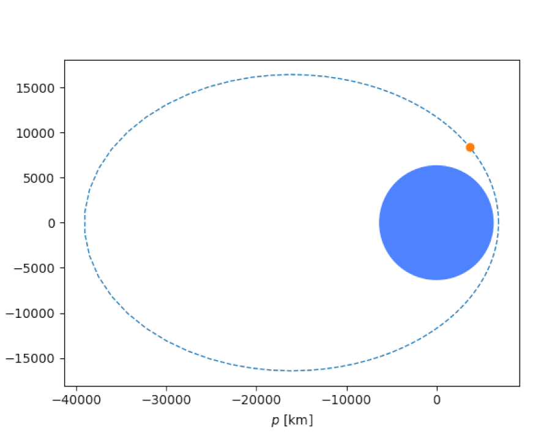

# Mr. Radar

<div align="center">


</div>

## Prompt

> Given the radar pulse returns of a satellite, determine its orbital parameters (assume two-body dynamics). Each pulse has been provided as:
> * t, timestamp (UTC)
> * az, azimuth (degrees) +/- 0.001 deg
> * el, elevation (degrees) +/- 0.001 deg
> * r, range (km) +/- 0.1 km
> The radar is located at Kwajalein, 8.7256 deg latitude, 167.715 deg longitude, 35m altitude.  
>
> Estimate the satellite's orbit by providing the following parameters:
> * a, semi-major axis (km)
> * e, eccentricity (dimensionless)
> * i, inclination (degrees)
> * Ω, RAAN (degrees)
> * ω, argument of perigee (degrees)
> * υ, true anomaly (degrees)
> at the time of the final radar pulse, 2021-06-27-00:09:52.000-UTC
> 
> ### Ticket
> 
> Present this ticket when connecting to the challenge:  
> `ticket{hotel708324victor2:...}`  
> Don't share your ticket with other teams. 
> 
> ### Connecting
> 
> Connect to the challenge on:  
> `moon-virus.satellitesabove.me:5021`  
> 
> Using netcat, you might run:  
> `nc moon-virus.satellitesabove.me 5021`
> 
> ### Files
> 
> You'll need these files to solve the challenge. 
> * [https://static.2021.hackasat.com/zwv7nd5sj9vj9wk88o8aul48eun9](https://static.2021.hackasat.com/zwv7nd5sj9vj9wk88o8aul48eun9)

## Solution

The provided [`radar_data.txt`](./radar_data.txt) file has 100 of the pulses mentioned in the prompt, each one second apart.  

```
time az(deg) el(deg) range(km)
2021-06-27-00:08:12.000-UTC	232.1248732	4.608410995	5561.036162
2021-06-27-00:08:13.000-UTC	232.1207825	4.687512746	5558.256788
2021-06-27-00:08:14.000-UTC	232.1161302	4.765942656	5555.508003
2021-06-27-00:08:15.000-UTC	232.1132568	4.843875409	5552.630467
...
```

Connecting to the server and providing the ticket gives no new information, but it does have a lovely banner:

```
                             RADAR
                           CHALLENGE


                      +o+
                   o    .
               o         .
            o             .
          o                .r
        o                   .
      o                      .
    o                         .
   o                           . az,el
  o                  ...........A......
 o      .................          ............
   .......                                    ...........
.....                                                    .....


Welcome to the Radar Challenge!
Given the radar pulse returns of a satellite, determine its orbital parameters (assume two-body dynamics).
Each pulse has been provided as:
   t,  timestamp (UTC)
   az, azimuth (degrees) +/- 0.001 deg
   el, elevation (degrees) +/- 0.001 deg
   r,  range (km) +/- 0.1 km
The radar is located at Kwajalein, 8.7256 deg latitude, 167.715 deg longitude, 35m altitude.

Estimate the satellite's orbit by providing the following parameters:
   a,  semi-major axis (km)
   e,  eccentricity (dimensionless)
   i,  inclination (degrees)
   Ω,  RAAN (degrees)
   ω,  argument of perigee (degrees)
   υ,  true anomaly (degrees)

What is the satellite's orbit at 2021-06-27 00:09:52 UTC?
   a (km):
```

One of the previous challenges in this category was to derive the orbital elements from the position and velocity of a spacecraft at a given time. There are many off-the-shelf tools that can do this, one of which is the [OrbitalPy](https://github.com/RazerM/orbital) package:

```
>>> orbit = orbital.KeplerianElements.from_state_vector(position, velocity, orbital.earth, ref_epoch)
>>> print(orbit)
KeplerianElements:
    Semimajor axis (a)                           =  24732.886 km
    Eccentricity (e)                             =      0.706807
    Inclination (i)                              =      0.1 deg
    Right ascension of the ascending node (raan) =     90.2 deg
    Argument of perigee (arg_pe)                 =    226.6 deg
    Mean anomaly at reference epoch (M0)         =     16.5 deg
    Period (T)                                   = 10:45:09.999830
    Reference epoch (ref_epoch)                  = 2021-06-26 19:20:00
        Mean anomaly (M)                         =     16.5 deg
        Time (t)                                 = 0:00:00
        Epoch (epoch)                            = 2021-06-26 19:20:00
```

Before the same tool can be applied to *this* problem, some information is needed:

* The position of the satellite at the last radar pulse in the J2000 [Earth-centered intertial (ECI)]https://en.wikipedia.org/wiki/Earth-centered_inertial) coordinate frame
* The velocity of the satellite at the last radar pulse in m/s
* The reference epoch provided in the prompt: `2021-06-27 00:09:52 UTC`

### Position

Knowing the azimuth, elevation, and range (AER) of the satellite from the perspective of an observer in Kwajalein along with the location of the observer is enough to convert between AER and ECI coordinates. 

The [Pymap3d](https://github.com/geospace-code/pymap3d) package provides several coordinate conversions, including `aer2eci()`:

```
x, y, z = pymap3d.aer2eci(azimuth, elevation, range * 1000, latitude, longitude, altitude, time, deg=True)
```

Feeding the last line of [`radar_data.txt`](./radar_data.txt) into this converter gives the correct position in the proper coordinate system for [OrbitalPy](https://github.com/RazerM/orbital). 

### Velocity

Velocity is the other half of the puzzle. Getting an accurate velocity with the data provided is not as simple as it might seem. Our initial, naive strategy was to estimate it by taking the difference of two positions. The issue is that the resulting velocity occurs at some unknown point between the two positions. Without having more granular data or more information about the orbit, a good estimate of instantaneous velocity is hard to determine. This graphic highlights the variance in the orbits using this approach:

<div align="center">


</div>

[Lambert's problem](https://en.wikipedia.org/wiki/Lambert%27s_problem) addresses this issue:

> Lambert's problem is concerned with the determination of an orbit from two position vectors and the time of flight

> The transfer time of a body moving between two points on a conic trajectory is a function only of the sum of the distances of the two points from the origin of the force, the linear distance between the points, and the semimajor axis of the conic.

Knowing the initial position, final position, time, and gravitational parameter of the central body, the velocity at a given point can be determined. And fortunately, Lambert solvers are widely available. The Python package [pytwobodyorbit](https://github.com/whiskie14142/pytwobodyorbit) contains the solver we used to complete this problem:

```
initial_velocity, terminal_velocity = pytwobodyorbit.lambert(initial_pos, final_pos, flight_time, earth_mu)
``` 

### Final Orbit

With the final AER coordinates converted to ECI and the terminal velocity from the Lambert function, we now have everything we need to get the orbital elements. 

```
>>> orbit = orbital.KeplerianElements.from_state_vector(final_pos, terminal_velocity, orbital.earth, ref_epoch)
>>> print(orbit)
KeplerianElements:
    Semimajor axis (a)                           =  22998.794 km
    Eccentricity (e)                             =      0.699924
    Inclination (i)                              =     34.0 deg
    Right ascension of the ascending node (raan) =     78.0 deg
    Argument of perigee (arg_pe)                 =    270.0 deg
    Mean anomaly at reference epoch (M0)         =     10.2 deg
    Period (T)                                   = 9:38:31.115455
    Reference epoch (ref_epoch)                  = 2021-06-27 00:09:52
        Mean anomaly (M)                         =     10.2 deg
        Time (t)                                 = 0:00:00
        Epoch (epoch)                            = 2021-06-27 00:09:52
>> print(math.degrees(orbit.f)) # true anomaly
66.3620935130588
```

```
You got it! Here's your flag:
flag{hotel708324victor2:GBDfMKHe9sabPGjWiePSWjczCxmWtNBYx0uNkkEwWMA1oPuptBlrACo5K2HXLupqJVpQwJhPcJUMpD-chTNrLwA}
```

<div align="center">


</div>

## Resources

* [OrbitalPy](https://github.com/RazerM/orbital)
* [Earth-centered inertial (ECI)](https://en.wikipedia.org/wiki/Earth-centered_inertial)
* [Pymap3d](https://github.com/geospace-code/pymap3d)
* [Lambert's problem](https://en.wikipedia.org/wiki/Lambert%27s_problem)
* [pytwobodyorbit](https://github.com/whiskie14142/pytwobodyorbit)
