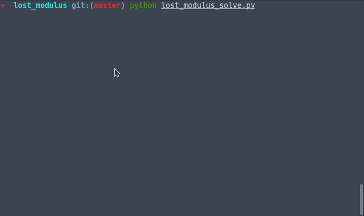

# Lost Modulus

## Description

> Crypto

I lost my modulus. Can you find it for me?

```
nc 13.112.92.9 21701
```

[crypto-33dee9470e5b5639777f7c50e4c650e3.py](./crypto-33dee9470e5b5639777f7c50e4c650e3.py)

## Writeup

The server script seems to implement the [Paillier
Cryptosystem](https://en.wikipedia.org/wiki/Paillier_cryptosystem),
and exposes the ability to perform some queries.

The server first gets two 512-bit primes `p` and `q`, and then
proceeds to perform standard key-generation to compute required
intermediates for encryption and decryption. One thing to note here is
that since `p` and `q` are of equivalent length, the simpler variant
for key generation is used, but otherwise it seems to be standard.

Once that is done, it encrypts the flag and sends it to us, and then
exposes the ability to perform a maximum of 2048 queries. These
queries can be one of two kinds `A` or `B`:

+ `A`: Encrypt arbitrary input
+ `B`: Decrypt arbitrary input, but only receive the least significant
		_byte_.

Upon reading the Wikipedia page for this cryptosystem, we realize that
it is additive-homomorphic. This means that we can produce the
encryption of any linear combination of messages, if we have the
encrypted messages themselves. In particular `D(E(m1) * E(m2)) == m1 +
m2`. This turns out to be extremely useful in solving this challenge.

Since we have the encrypted flag (which we'll call `flag_enc`), and we
have a lsB (least significant _byte_) decryption oracle (query `B`),
we can easily obtain the least significant byte of the flag. If we
know `modinv(256, n * n)`, we can repeatedly subtract out the least
significant byte (since Paillier is additive-homomorphic), and then
multiply by this value (which effectively divides it by 256), and then
perform query `B` to obtain the entire flag.

However, we are not provided `n` by the server, hence the name of the
challenge "Lost Modulus", we presume.

To find `n`, we considered a bunch of different approaches, two of
which were msb (most significant bit) based leak, and binary
search. We were unable to get the msb approach working, so we decided
upon the binary search.

The binary search technique required usage of the fact that if we
encrypted a value (say `x`) that was larger than or equal to `n`, and
then decrypted it, then the least significant byte would not match up
with `x`'s least significant byte. However, if `x` was smaller than
`n`, then it would match up. Notice that we require 2 operations for
each query for the binary search here (`A` to encrypt, and `B` to get
the lsB). Since `n` is 1024 bits long (as both `p` and `q` are 512
bytes each, and `n = p * q`), this would take 2048 queries.

And this is where we hit upon the query limitation. Within the number
of queries that it would require to get `n`, we would no longer have
any queries left to get the flag. Recall that `n` changes on each
connection.

Recall that to get one byte of the flag, we require two operations
(one to find out what value to subtract, and another to perform the
decoding after the multiply). This meant that every 2 operations that
we could shave off of the 2048 required for the binary search would
give us 1 more byte of the flag.

The first 2 operations are easy to shave off: `n` _must_ be odd (since
`p` and `q` are odd, as they are large primes), which means that the
lsb of `n` must be a 1. At this moment, we decided to write up a
script to perform the attack.

Unfortunately, it took approximately half an hour (due to round trip
times) to perform all the queries required to get `n`, which only
revealed one byte of the flag. We _could possibly_ parallelize this,
except we need to know the "previous" byte of the flag to calculate
the "current" byte, so it must happen one after another. We _could
possibly_ get around this issue, by calculating many `n`s together,
while keeping open connections, waiting for previous bytes of the flag
to be flushed, and then use them, however the server allowed only 4
concurrent connections. Due to the size of `n`, we knew that the flag
could be upto 128 bytes, which meant even this was infeasible, so we
decided to try to improve the query performance further.

We then started thinking about how we might do the binary search
differently. Recall that Paillier is additive-homomorphic, which means
if we pre-compute a table of encrypted values (using type `A`
queries), and if some value we want to encrypt is a linear combination
of these, then we can simply obtain it directly. This saves us on `A`
type of queries. A good set of values to pre-fetch are powers of two,
since we can simply look at the binary encoding of a number, except
there are 1024 powers of 2, which are potentially smaller than `n`,
which doesn't give us any savings.

However, we realize that we can simply pre-fetch (using type `A`
queries) only some subset of them, using the fact that `2^(n+1) ==
2^n`, which can give us the rest of the values. We thus settled upon
pre-fetching for `2^0`, `2^2`, `2^4`, ... (which is a total of 512
queries). Notice that this save us 512 queries, which is more than
sufficient to obtain the flag in a single connection.

When we implement this however, we faced an issue (which in hindsight
should've been a non-issue, since we should've taken everything modulo
`n^2`) but it took a long time to actually perform all the multiplies
needed to get the encrypted form of a number with lots of `1`s in its
binary representation, in terms of CPU time. Recall that to add `m1`
and `m2`, in the encrypted world we need to multiply them. Thus, we
decided to add in memoization, with a randomized fetching via a type
`A` query, for about 10% of the numbers that we wanted to
encrypt. Overall, this meant that although we were making more
queries, we would be able to get values much faster.

Overall, our [script](./lost_modulus_solve.py) finds the flag in
approximately 1700~1800 queries.

## Script Demo

Simply because the attack has an almost movie-like decryption, here's
a gif demo of the scipt:



## Explanation of Script

### Query Setup

This part simply imports all important libraries, and sets up two
extremely useful helper functions `cmdA` and `cmdB` that can be used
to quickly perform queries. It also sets up a global running counter
of number of queries used (which during the CTF, we called "commands
run"). This made it easy for us to diagnose how things are going while
it is running.

```
from pwn import *
from Crypto.Util.number import *
from gmpy import *
from os import getenv
from random import random


commands_run = 0
commands_run_prog = log.progress("Commands run")


def cmd(c, inp):
	global commands_run
	commands_run += 1
	commands_run_prog.status(str(commands_run))
	conn.recvuntil("cmd: ")
	conn.sendline(c)
	conn.recvuntil("input: ")
	conn.sendline(long_to_bytes(inp).encode('hex'))
	return bytes_to_long(conn.recvline().strip().decode('hex'))
```

### Stage 0

Here, we set up the connection to the server, and get the encrypted
flag `flag_enc`.

```
def stage0():
	global conn, flag_enc
	if getenv('LOCAL') != "TRUE":
		conn = remote('13.112.92.9', 21701)
	else:
		conn = process('./crypto-33dee9470e5b5639777f7c50e4c650e3.py')
	conn.recvline()
	flag_enc = conn.recvline().strip()
	flag_enc = bytes_to_long(flag_enc.decode('hex'))
	log.success("Stage 0: Complete")
```

### Stage 1

Now, we have to prime up the encode function by pre-fetching the
requisite data. We additionally set up a separate `encode` function
which uses the pre-fetched memo, in order to reduce the number of
queries required. It also performs `cmdA` with 10% probability, to
speed up encryptions as mentioned above.

```
memo = {}


def stage1():
	global memo
	prog = log.progress("Stage 1")
	for i in xrange(1024):
		prog.status(str(i))
		if i % 2 == 0:
			val = cmdA(2 ** i)
		else:
			prev = memo[2 ** (i - 1)]
			val = prev * prev
		memo[2 ** i] = val
	prog.success("Complete")


def encode(inp):
	global memo
	if random() < 0.1:
		memo[inp] = cmdA(inp)
		return memo[inp]
	val = None
	inp_copy = inp
	for k in sorted(memo.keys())[::-1]:
		while k <= inp:
			if val is None:
				val = 1
			val *= memo[k]
			inp -= k
	memo[inp_copy] = val
	assert inp == 0, repr(inp)
	return val
```

### Stage 2

Now, we move on to actually computing the value of `n`. This is a
relatively standard binary search, with minor modifications to ensure
that we are only looking at odd numbers.

```
def stage2():
	global n
	checks = 0
	low = 0
	high = 2**1023
	prog = log.progress("Stage 2")
	while low <= high:
		mid = (low + high) // 2
		checks += 1
		prog.status("low = %s, high = %s" %
					(hex(low), hex(high)))
		test = mid * 2 + 1
		y = cmdB(encode(test))
		x = test % 256
		if x != y:
			high = mid - 1
		elif x == y:
			low = mid + 1
		else:
			assert False
	prog.success("Complete")
	n = low * 2 + 1
```

### Stage 3

Now that we have `n`, we have to compute the flag.

```
def stage3():
	global flag
	shifter = invert(256, n * n)
	known_flag = []
	prog = log.progress("Stage 3")
	for lsh in xrange(128):
		assert lsh == len(known_flag)
		val = flag_enc
		prev_lsh = lsh - 1
		subtr_val = 0
		while prev_lsh >= 0:
			prev = known_flag[prev_lsh]
			subtr_val *= 256
			subtr_val += prev
			prev_lsh -= 1
		if lsh > 0:
			neg = ((n * n) - subtr_val) % (n * n)
			val = val * cmdA(neg)
		test = pow(val, shifter ** lsh, n * n)
		known_flag.append(cmdB(test))
		if known_flag[-1] == 0:
			break
		prog.status(repr(''.join(map(chr, known_flag))[::-1]))
	flag = ''.join(map(chr, known_flag))[::-1].strip('\0')
	prog.success("Complete")
```

### Profit

We call out all the stages in order, and profit with a flag!

```
stage0()
stage1()
stage2()
stage3()
log.success("FLAGE!!! " + repr(flag))
```

## Flag

```
hitcon{binary__search__and_least_significant_BYTE_oracle_in_paillier!!}
```

---

**~** f0xtr0t (Jay Bosamiya)
