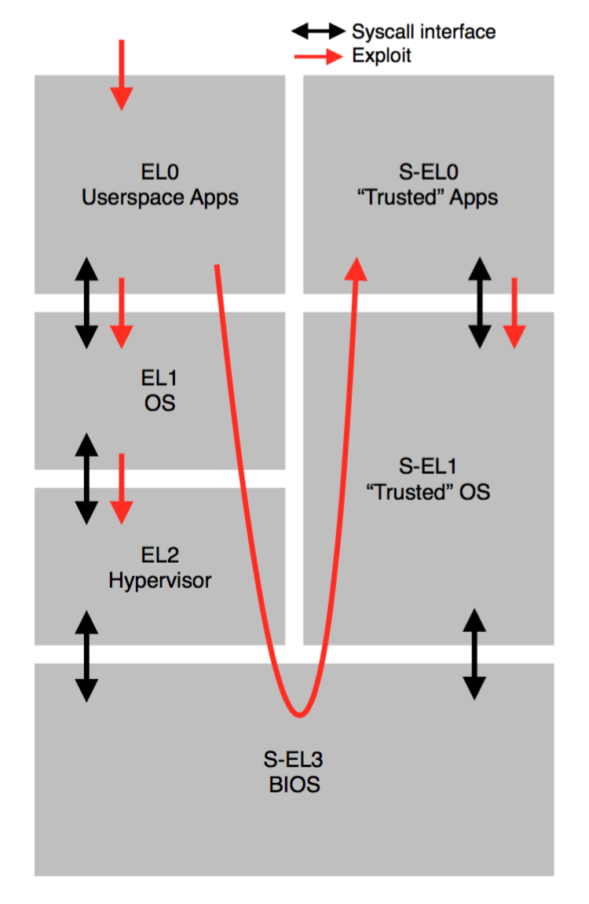

## Super Hexagon

Super Hexagon is a AArch64 bios that sets up a full OS stack—with code running at different privilege levels (“rings”, in x86 terminology)—as well as making use of ARM’s “TrustZone” features (which more-or-less just acts as a couple of additional privilege levels).

The qemu emulator running this bios has been modified with additional model-specific registers that contain a unique flag for each privilege level they are called from. So, there are six flags available in this challenge, and the goal is to gain code execution within each privilege level to read out the flag via the MSRs.



### Exploiting EL0

The EL0 component of Super Hexagon is an AArch64 ELF binary. (For readers following along, it can be extracted from `bios.bin` by finding `\x7FELF` and copying from there to the end of `bios.bin`). It has debug info and symbol names, so you don’t really need to reverse the BIOS to figure out what its syscalls do. It’s also clear from interacting with the Super Hexagon service that this is the first level of code that you interact with, so knowing exactly how the BIOS loads the ELF binary isn’t required at this point.

Looking at the relatively small ELF, there’s an obvious `gets()` call that fills a global buffer named “`input`” lying right before a function pointer (`cmd[0]`). This ELF has a `print_flag()` function available (that does the required register reading, and sends the result back over the network), and there’s no ASLR or anything. So, to get the flag for EL0, you just:

1. Navigate to the point of the `gets()`
2. Write 256 junk chars to fill up `input`
3. Write the address of `print_flag` (0x400104).
4. End the line, then trigger `cmd[0]` to call `print_flag()`.

Just running `printf '1\n1\n%0256d\x04\x01\x40\x00\x00\x00\x00\n0\n0\n' | nc 127.0.0.1 6666` achieves this.


### Actually exploiting EL0

Getting the flag for EL0 didn’t require real code exec, but to proceed in this challenge does.

The trick to get arbitrary code execution in EL0 is to call `mprotect()` instead of `print_flag()`. This works well because we “coincidentally” control many arguments of the overwritten function pointer call. When `cmd[1]` is called:

1. The first argument to the called function is a buffer with user-controlled data in it.
2. The second argument is just `atoi()` of a user-submitted integer
3. The third argument is the `strlen()` of that first user-controlled buffer, allowing us to control it (for small integer values).

So, loosely speaking, we can use the function-pointer overflow to first run `mprotect(buf, 0x1000, RX)`, and then run `buf()`, where the contents of `buf` are user-controlled.

There are several details to get right to make this exploit work out. First off, the Super Hexagon kernel denies `mprotect()` creating RWX pages; it’s limited to RW or RX pages. It takes some light reversing of the application logic to be sure to not write to `buf` after `mprotect()`ing it to RX (instead of the usual RW). For example, the codepath for using the buffer overflow to set the function pointers is no longer available after the `mprotect()`, so the exploit strategy must be tweaked to place `buf` into `cmd[0]` and `mprotect()` into `cmd[1]` at the same time, before `mprotect()` is actually called.

Another detail is that `buf` is not entirely user controlled; it’s filled using `scanf("%s", buf)`. So, the shellcode must be whitespace free and null free (I didn’t reverse their `scanf()` implementation, but this is true for standard `scanf()` and seemed true here too). Fortunately, AArch64 was pretty easy to do null-free and whitespace-free shellcoding for, and I just whipped up a stager payload to `mmap()` & `read()` & `mprotect()` a new buffer to allow arbitrary shellcode—and, more of it than could be fit into the original `buf`.

The full exploit script is attached in `el0.py`.

### Exploiting S-EL0

S-EL0 is a chunk of Thumb-2 code that actually comes from within the EL0 ELF (the `TA_BIN` global, for those following along). The EL0 ELF "uploads" this Thumb-2 code via its special `tc_init_trustlet()` syscall. At higher privilege levels, the BIOS starts up this code inside S-EL0. Then, the EL0 ELF uses its `tc_register_wsm()` and `tc_tci_call()` syscalls to establish shared memory regions and interact with the S-EL0 Thumb-2 code.

You can’t just use EL0 code exec to upload a print-flag program into S-EL0, though: the BIOS (more precisely, the S-EL1 OS) checks that the Thumb-2 code matches a certain hash. This upload process is supposed to simulate the real-world process of unprivileged code loading a signed, trusted executable into a higher privilege level (even though in this CTF problem, it’s a static SHA256 hash check instead of a real public-key signing mechanism). So, the only choice is to exploit the given Thumb-2 program.

CTF strategy note: we hadn’t yet bothered to reverse all of the above when starting work on S-EL0. We actually just assumed that something like it would be true. This isn’t necessarily a great assumption, and we should have and could have verified it just by trying to re-call `tc_init_trustlet()`. (In fact, it looks like the CTF may have originally opened with a buggy version of S-EL1 that did not actually check the hash! Unclear if just running `tc_init_trustlet()` would have been enough at that point in time. Regardless, the challenge was updated to a version with the correct hash-check before we got to this stage).

Unlike the EL0 ELF, the S-EL0 Thumb-2 blob was not an ELF. It wasn’t immediately clear how it was supposed to get loaded (and, we didn’t attempt reversing the S-EL1 loader code until later). We just started by noticing that most of the blob was well-decoding Thumb-2 instructions and loading that up in IDA at address 0. Later, with the help of seeing constant addresses in the code, we realize that the blob’s header of `[0x1000, 0x684, 0x2000, 0xA8, 0x100000, 0x81070]` meant "size 0x684 .text section at 0x1000, size 0xA8 .data section at 0x2000, size 0x81070 .bss section at 0x100000". This lined up nicely with how the code was using the data section, e.g. with the correct locations functions now appeared to `strcpy()` appropriate error messages from the data section.

The S-EL0 Thumb-2 app is very small, so it was easy to completely reverse: just some string functions, the handlers for the EL0 ELF’s `tc_tci_call()` calls (one for `cmd_load`, another for `cmd_store`), and a `malloc()` & `free()`. The syscalls made by the Thumb-2 code were obvious from the context, and did not require reversing S-EL1.

The essential behavior of the S-EL0 app is to store to 9 buffers of data. When the EL0 ELF issues a “store” command for a particular slot (0 thru 9), S-EL0 `free()`s any pre-existing buffer, `malloc()`s a new one, and copies the bytes from EL0 in.

The bug in the S-EL0 Thumb-2 app is right at the start of `malloc()`:

```c
void *malloc(unsigned size) {
  if(!malloc_initlaized)
    initialize_malloc();
  size += 0x1f;
  if(size <= 0x1f)
    size = 0x20
  else
    size &= 0xFFFFFFF0;
  ...
}
```

The potential addition overflow in `size += 0x1f` means that a big malloc like `malloc(0xFFFFFFF0)` will be equivalent to `malloc(0x20)`. This is similar to the classic integer-overflow malloc bug: we trick the S-EL0 app into attempting to allocate 0xFFFFFFF0 bytes, and instead of failing with an out-of-memory error it succeeds and incorrectly believes that a size 32 buffer is actually 0xFFFFFFF0 long. We can (probably) corrupt heap metadata via buffer overflow to gain arbitrary read and write.

With code exec inside of the EL0 ELF, it’s easy to issue bad calls (with huge sizes) to S-EL0 that trigger this bug. This triggers a buffer-overflowing, heap-corrupting copy of EL0-provided data inside of S-EL0. The copy is huge and triggers a segfault inside of S-EL0, but it doesn’t matter: the way this BIOS is set up, a segfault in S-EL0 doesn’t “crash”: it just returns an error message to EL0. Any future calls into the S-EL0 app just start from the handler entry point as normal, regardless of the fact that S-EL0’s memory is corrupted.

I started by trying to corrupt malloc metadata into having a chunk of the stack on the free-list, to gain ROP inside S-EL0. I was unsuccessful at this, partially because debugging stuff inside of QEMU is hard and annoying (I resorted to passing `-d cpu,exec,int,in_asm` to QEMU in order to debug), but mostly because I’m new at heap exploitation :P

While failing, I noticed that portions of S-EL0’s text section were getting overwritten thanks to my corrupted malloc metadata, leading to the realization that all of S-EL0 is effectively RWX. Huh. Maybe should have taken time to reverse the S-EL1 loader after all!

By spamming and adjusting my failed attempt, I got an overwrite of 4 mostly-arbitrary bytes into a somewhat-controlled address within S-EL0. This was enough to insert a `bx r0` at a point in time where `r0` contains the address of the shared memory region between EL0 and S-EL0, which I could pre-fill will Thumb-2 shellcode. The code for this exploit is attached in `sel0.c`.

### Exploiting EL1

The bug in EL1 (the kernel), is trivial. The `read` and `write` syscalls
do not validate that the addresses are in userspace. This gives us
arbitrary read/write with one minor caveat: While the `write` syscall
writes out all of the requested bytes, the `read` syscall reads at most
one byte per invocation.

First, the exploit sets up `read(addr, n)` and `write(addr, data)`
functions callable from Python.

Since the `read` reads exactly one byte, we cannot simply overwrite a
return address. We cannot directly overwrite kernel code, because W^X is
enforced by EL2. Instead, we manipulate page tables to map our own code
over kernel code.

Using the `mmap` syscall, we map a page, and write the contents of the
page containing the kernel's syscall handler function. We then patch the
contents so that the syscall handler function will run shellcode of our
choice instead. We mprotect it executable (since WX pages are blocked).

We determine our page's IPA (Intermediate Physical Address). We then
find the page table which maps the syscall handler page and map that
into userspace by editing page tables. Finally, we run some code which
remaps the syscall handler page to our page's IPA by writing to page
table that we just mapped into userspace. Finally, we execute a syscall,
which calls our modified syscall handler function and runs our
shellcode.

This gives code execution in EL1 (the kernel).

### Exploiting EL2

EL2 (the hypervisor) only has one interesting hypercall:

`el2_map_ipa(ipa, flags)`

This maps an IPA into the kernel's "physical" address space. This
implementation look like this:

```c
void el2_map_ipa(uint64_t ipa, uint64_t flags) {
  uint64_t idx = (ipa >> 12) & 0x1FF;
  if (pa == 0x3b000) {
    // Special case for mapping UART.
    ...
    return;
  }

  // Ensure the requested IPA falls within the reserved kernel memory
  // range at [0x40000000, 0x4003c000)
  if (ipa >= 0x3c000) {
    panic("[VMM] Invalid IPA")
  }

  // Prohibit mapping the IPAs reserved for kernel code writable (not
  // relevant for exploiting EL2).
  if (ipa < 0xc000 && flags & 0x80) {
    panic("[VMM] try to map writable pages in RO protected area");
  }

  // Ensure that XN is enabled if the page is writable.
  if ((flags & 0x40000000000080i64) == 0x80) {
    panic("[VMM] RWX pages are not allowed");
  }

  // Map the the IPA in the EL1 to the address 0x40000000 + ipa in EL2.
  vttbr_el2_translation_tables.entry[idx + (ipa >> 21 << 9)] = (ipa + 0x40000000) | flags;
}
```

The bug is that the checks can be bypassed by placing address bits in
the `flags` parameter and page table flags bits in the `ipa` parameter.
This allows mapping RWX memory out of bounds of the reserved memory
region in EL2.

The exploit does:
```python
# ipa_table_base is the address of vttbr_el2_translation_tables inside
# the hypervisor
ipa_table_base = 0x40107000
ipa_table_ipa = 0x7000
# Put the writable flag into the IPA param and or the address into the
# flags param. The resulting translation table entry (made by orring these
# two together) will map IPA 0x7000 RW to 0x40107000 in el2.
map_ipa(ipa_table_ipa | 0x80, 0x443 | ipa_table_base)
```

This maps the virtualization translation table from EL2 into the kernel
address space, allows us to expose arbitrary memory from EL2 into EL1.
We mapped the memory backing the hypercall handler into EL1, overwrite
it with shellcode to run in EL2, then run the shellcode by performing a
hypercall.

See
[exploit\_el12.py](https://github.com/pwning/public-writeup/blob/master/hitcon2018/super_hexagon/exploit_el12.py)
for our EL1 and EL2 exploits.

### Exploiting S-EL1 and S-EL3

We ran out of time in the CTF. DragonSector didn’t, though, so go see their writeup!
