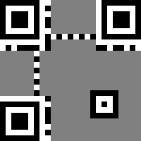
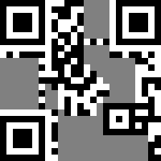
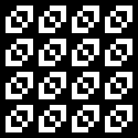
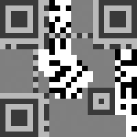
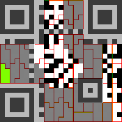
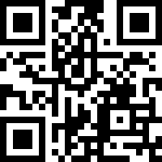

## QR code recovery challenge - Misc 400 Problem - Writeup by Robert Xiao (@nneonneo)

We're given a QR code which is missing a ton of pixels:

>

Obviously, if you try to scan the QR code with a normal reader, nothing will happen.
I chose to solve this challenge by reconstructing and decoding the QR code by hand. It's pretty
time-consuming but I learned a lot about how QR codes work in the process.

There's a fantastic [QR Code Tutorial](http://www.thonky.com/qr-code-tutorial/) online which
provides lots of details about the format. It lays out seven steps to encode a QR code:

1. Determine which encoding mode to use
2. Encode the data
3. Generate error correction codewords
4. Interleave blocks if necessary
5. Place the data and error correction bits in the matrix
6. Apply the mask patterns and determine which one results in the lowest penalty
7. Add format and version information

I followed the steps in reverse, making repairs where necessary.

### Format and Version Information

First off, from the size of the QR code (25x25) we can infer it is a "version 2" code.
QR codes have a fixed set of patterns that are placed in predictable locations. This
image lays out those different fixed patterns:

>

Since we know exactly where the Finder, Timing and Alignment patterns are, we can reconstruct
those pretty simply. Version 2 codes don't have "Version Info" so we ignore that. Finally,
for the Format Info, we have to reconstruct that based on what is visible.

The format information is encoded twice. One instance is wrapped around the top-left Finder,
and the other instance is split in half between the bottom-left and top-right Finder patterns.
The format information consists of exactly 15 bits. Here are the bits we can see in our QR code:

    ??????011011010

(note that white=0 and black=1). We look up the partial bits in the [Format and Version String Tables](http://www.thonky.com/qr-code-tutorial/format-version-tables)
and find that it corresponds to ECC Level Q, Mask Pattern 6. The full format information string is

    010111011011010

and so we can encode that, together with the repaired fixed patterns:

>

and overlay that on the challenge code:

>

Alas, that still doesn't scan. Guess we'll try to extract the bits by hand.

### Data Masking

The QR code is masked to break up patterns (e.g. uniform regions, areas that look like QR code
format patterns, etc.). The format has eight different mask patterns defined. Each mask is a 6x6
repeating pattern which is XORed across the packed data bits.

In our case, the format information says we're using mask 6, which looks like this:

>

We apply the mask to our challenge image (inverting where the mask is black) and overlay the
original format information (greyed out so the data bits are clearly shown):

>

Now we just have to extract the data bits.

### Module Placement in Matrix

The bits of the message are placed into the QR code matrix in a very particular order. Starting from the bottom right,
bits are packed into two columns at a time, moving in a snake-like pattern up and down:

>

The bits are packed as 8-bit units. This diagram shows where those unit boundaries are in a version 2 code:

>

We overlay this guide on top of our QR code:

>

and start reading off the bits. Here are the bits that I extracted (with ? where the bit is missing):

    00100000
    10100010
    10111000
    00111010
    01011001
    10011010
    10001000
    ????????
    ????????
    ????????
    ????????
    ????????
    ????????
    ????????
    ????????
    ??00000?
    1???????
    ????????
    ????????
    ????????
    ????????
    ??010001
    00100100
    1???????
    ????????
    ????????
    ?????010
    11000011
    10000000
    10101100
    00010000
    11100100
    10101010
    10011001
    01100110
    ????????
    ????????
    ?????0?0
    0000000?
    ????????
    ????????
    ????????
    ????????
    ????????

There's a lot of missing bits there. Maybe error correction can help?

### Structure Final Message

Because this is a version 2 code, there's only one block of data and error bits. Therefore,
no structuring is required: the error bits immediately follow the data bits.

There's a total of 22 data bytes and 22 error bytes, since we're using a "Q"-level code.

### Error Correction Coding

This is where it gets interesting. QR codes use Reed-Solomon error correction coding at the
byte level. At the Q level, it can recover from 25% of the bytes being corrupt. Unfortunately,
we have only 16 intact bytes, or over 63% of the bytes missing. So maybe this isn't doable after all...

...until you look carefully at Reed-Solomon's error correcting capabilities and realize that
it can correct up to *twice* as many *erasures* - that is, if it *knows* where the errors
are, the error correction capabilities are much stronger. That means our code can recover from
up to 50% of the bytes being missing! But that means we can only correct up to 22 missing bytes;
we're missing 28. Maybe we can obtain some missing bytes based on the data encoding?

Let's set aside error correction coding for now and look at the data format.

### Data Encoding

Our message starts with the bits 0010, which according to [this table](http://www.thonky.com/qr-code-tutorial/data-encoding) 
means the code is in the *alphanumeric mode*. Since it's a version 2 QR code, the next 9 bits
are the length. Those bits are 000010100, which means that there are 20 characters.

In the alphanumeric mode, every *pair* of characters is packed into an 11-bit chunk. Thus, there are
a total of 110 bits for the payload.

Here are the data bits we have, broken down:

    0010 [mode=alphanumeric]
    000010100 [length=20]
    01010111000 ["FL"]
    00111010010 ["AG"]
    11001100110 [" I"]
    1010001000? ["S?"]

What a troll - the visible bits just say "FLAG IS". Well, guess we're definitely going to have to recover the
flag itself from error correction.

Format Q gives us 22 bytes, or 176 bits of data. We only use 4+9+110 = 123 bits, so the rest of the data
segment has to be *padded*. The QR code spec says that we add up to 4 zero bits of "terminator", then zero bits
up to a byte boundary, then add *pad bytes* up to the data limit. The pad bytes just alternate between
11101100 and 00010001. If we apply that to our data bits, we get

    00100000
    10100010
    10111000
    00111010
    01011001
    10011010
    10001000
    ????????
    ????????
    ????????
    ????????
    ????????
    ????????
    ????????
    ????????
    ??000000 < terminator here, padded up to 0s
    11101100 < padding bytes here
    00010001
    11101100
    00010001
    11101100
    00010001

Woohoo! By adding the pad bytes that we already know (from the data encoding format), we have successfully
recovered 6 bytes, bringing the total number of missing bytes down to 22. Now we can apply error correction!

### Error Correction, again

Happily, someone has already written a [QR-compatible Reed-Solomon library for Python](https://github.com/tomerfiliba/reedsolomon),
so I don't have to figure out all the nitty-gritty math involved.

We use `reedsolo.rs_correct_msg` to correct the message with the erasure positions set (see `rs_recover.py`) and recover the message:

    00100000
    10100010
    10111000
    00111010
    01011001
    10011010
    10001000
    00101111
    10000110
    11100010
    10110110
    10011001
    01001010
    11000011
    00010101
    00000000
    11101100
    00010001
    11101100
    00010001
    11101100
    00010001

Split that up and decode:

    0010 [mode=alphanumeric]
    000010100 [length=20]
    01010111000 ["FL"]
    00111010010 ["AG"]
    11001100110 [" I"]
    10100010000 ["S "]
    01011111000 ["G+"]
    01101110001 ["JQ"]
    01011011010 ["GA"]
    01100101001 ["H:"]
    01011000011 ["FW"]
    00010101000 ["3X"]
    0000 [terminator]
    0 [byte padding]
    11101100 00010001 [pad bytes]
    11101100 00010001
    11101100 00010001

And so the flag is **G+JQGAH:FW3X**! It might seem random and meaningless, but trust me, it's the right flag :)

Here's the full QR code, if you're curious:

>

This was obtained by encoding the message using [this online encoder](www.thonky.com/qrcode/); because
of the stringency of the QR code spec, the output uses the same settings as the original code did,
and so the same QR code is obtained.
