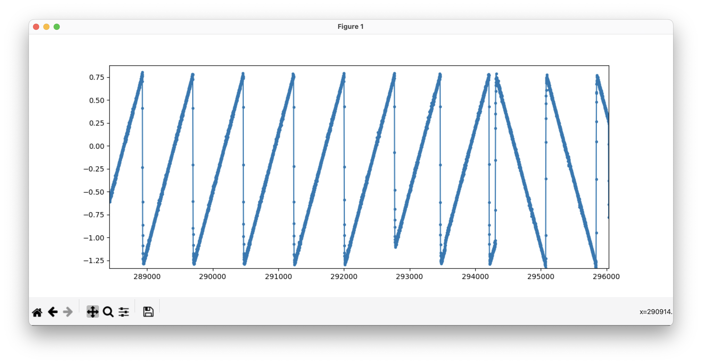
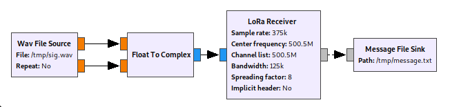

### longrange

Long Range was a misc challenge in Real World CTF 2023, worth 338 points with 8 solvers.

We're given a 23MB wav file representing a captured RF signal. Metadata on the file indicates that it was captured by an Airspy Mini SDR with a center frequency of 500.5125 MHz and a bandwidth of 375 kHz.

The file has two channels, representing the real and imaginary components of the captured complex signal. It sounds like a series of short bursts of noise separated by ~1 second of silence. By looking at the frequency plot in e.g. Adobe Audition or Audacity, we can see that the bursts actually consist of short, ~2ms linear frequency sweeps.

We can use e.g. Python to plot the frequency in more detail ([`plot_freq.py`](plot_freq.py)):

```python
import numpy as np
import scipy.io.wavfile as wf
import matplotlib.pyplot as pp
import scipy.signal as ss

rate, data = wf.read("sig.wav")
data = data / 32768.0
data = data[:, 0] + 1j * data[:, 1]

valid = np.abs(data) > 0.015
dvalid = valid[1:] & valid[:-1]

freq = np.diff(np.angle(data)) * dvalid
freq[freq > np.pi] -= 2 * np.pi
freq[freq < -np.pi] += 2 * np.pi
pp.plot(freq, ".-")
pp.show(block=True)
```

This shows us the following plot:



The linear sweeps become much more obvious in this view. Doing a little bit of Googling, we find out about the [LoRa ("Long Range") radio protocol](https://en.wikipedia.org/wiki/LoRa), which uses "chirp spread spectrum" modulation - essentially, sequences of cyclically-shifted frequency sweeps, just like we see here.

Thus, decoding the transmission is a simple matter of finding out how to decode LoRa. We identified that the signal matched the downlink frequency of [LoRa in China](https://www.everythingrf.com/community/lora-frequency-band-in-china) for channel 1. From the frequency plot, we can see that the frequency range (bandwidth) of the signal is around 1/3 of the sample rate, i.e. 125 kHz, which is a standard LoRa value.

The observed chirps matched the LoRa pre-amble per a [LoRa reversing report](https://www.epfl.ch/labs/tcl/wp-content/uploads/2020/02/Reverse_Eng_Report.pdf). Each chirp was around 2ms long, which corresponded with a spreading factor of 8 at a bandwidth of 125 kHz (Ts ~= 0.002 => 2^SF = Ts * BW ~= 250 => SF = 8).

Using GNURadio and the [gr-lora plugin](https://github.com/rpp0/gr-lora/) (at commit [6111c350c589bee9cc11c0e1d7c3a83fff284843](https://github.com/rpp0/gr-lora/tree/6111c350c589bee9cc11c0e1d7c3a83fff284843) for compatibility with GNURadio 3.8.5.0), we designed the following decoder:



The GNURadio file is [`lora.grc`](lora.grc) and the corresponding generated Python script is [`lora.py`](lora.py).

The script decrypts the LoRa message into the following hex bytes:

```
 08 30 00 41 6e 79 6f 6e 65 20 3f 8e dc
 08 30 00 41 6e 79 6f 6e 65 20 3f 8e dc
 08 30 00 41 6e 79 6f 6e 65 20 3f 8e dc
 08 30 00 41 6e 79 6f 6e 65 20 3f 8e dc
 08 30 00 41 6e 79 6f 6e 65 20 3f 8e dc
 08 30 00 41 6e 79 6f 6e 65 20 3f 8e dc
 08 30 00 41 6e 79 6f 6e 65 20 3f 8e dc
 08 30 00 41 6e 79 6f 6e 65 20 3f 8e dc
 08 30 00 41 6e 79 6f 6e 65 20 3f 8e dc
 4e 31 70 57 65 6c 63 6f 6d 65 2c 20 42 65 20 41 20 52 57 43 54 46 65 72 21 20 72 77 63 74 66 7b 47 72 33 33 74 5f 46 72 30 6d 5f 4c 6f 52 34 5f 32 36 39 33 32 38 30 32 66 32 36 61 38 63 39 62 34 35 31 39 65 62 36 66 39 30 30 66 36 37 36 66 7d 83 c3
 08 30 00 41 6e 79 6f 6e 65 20 3f 8e dc
 08 30 00 41 6e 79 6f 6e 65 20 3f 8e dc
 08 30 00 41 22 7d 23 9e 98 33 ba 22 6a
 08 30 00 41 6e 79 6f 6e 65 20 3f 8e dc
```

From this, we can read the flag from the longest message: `Welcome, Be A RWCTFer! rwctf{Gr33t_Fr0m_LoR4_26932802f26a8c9b4519eb6f900f676f}`
