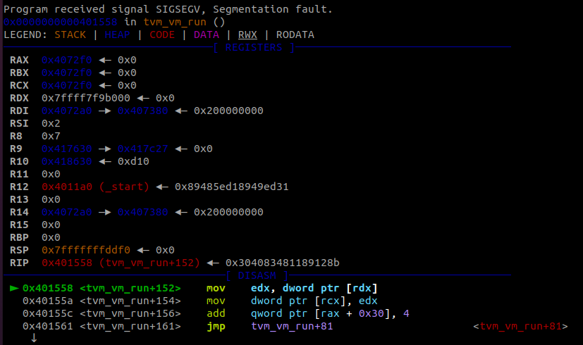
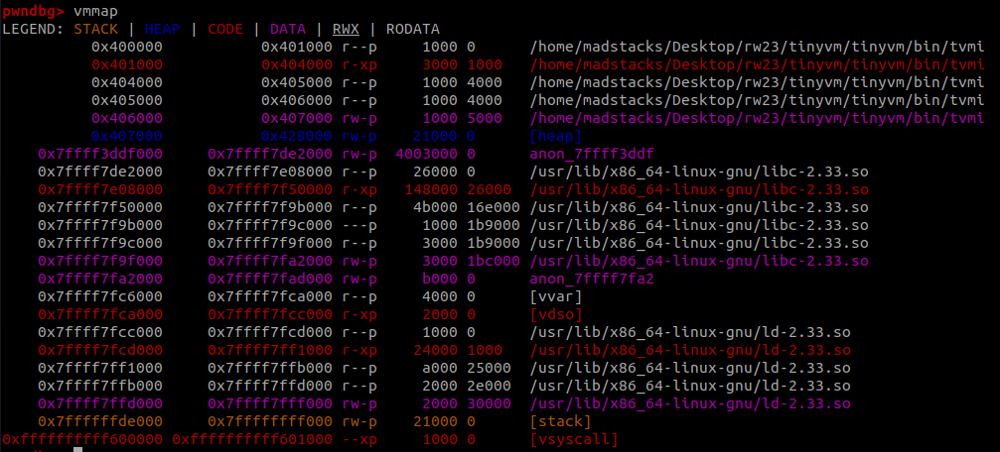
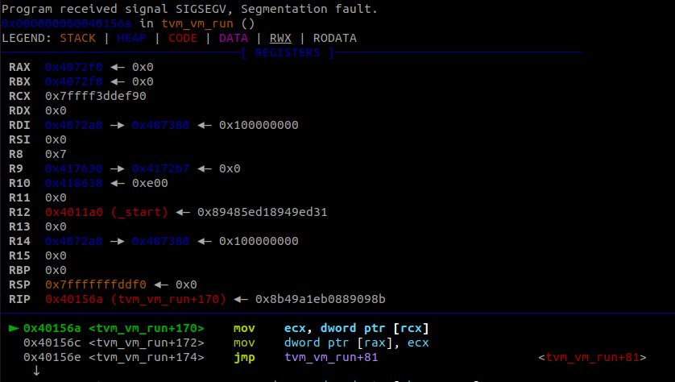
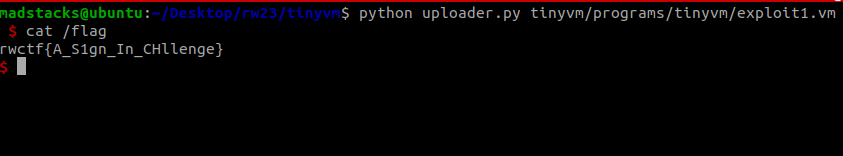

# tinyvm

Score: 188

_Solved by 22 Teams_

`Clone-and-Pwn`, `difficulty:Baby`

This is a CTF challenge called TinyVM. The author is very lazy, not wanting to write a description of the challenge, and the code is directly cloned from [https://github.com/jakogut/tinyvm](https://github.com/jakogut/tinyvm). So you can just `nc 198.11.180.84 6666` and get flag.


## Challenge Summary

The goal of TinyVM is to be small, so there is likely not a lot of code ensuring memory safety. The code is quick to download and compile, and it has a few example programs that show its functionality, making it pretty straightforward to get started.

## Vulnerabilities

As an initial test, I just wanted to see what would happen after several `pop` operations.

```
start:
    pop eax
    jmp start
```



It looks like the crash is at a page boundary, which makes a lot of sense, so we look at the memory map to get a better picture of what happened.



There are a couple interesting things to note here:

1. When I change the loop to use `push` ops instead, we crash with a write operation at the lower boundary of the page mapping, just below libc in memory, so this is probably our VM's memory space
2. It is mapped directly next to libc, so we get arbitrary read/~~write~~ into libc as we overflow our boundary
3. We are actually crashing on a page in libc that appears to be a guard page. Everything below it in memory is only readable, not writeable

After some looking through the code base I find where `push`/`pop` is implemented. From `tvm.h` we have the switch statement that works on opcodes

```
static inline void tvm_step(struct tvm_ctx *vm, int *instr_idx)
{
	int **args = vm->prog->args[*instr_idx];

	switch (vm->prog->instr[*instr_idx]) {
/* nop   */	case 0x0:  break;
/* int   */	case 0x1:  /* unimplemented */ break;
/* mov   */	case 0x2:  *args[0] = *args[1]; break;
/* push  */	case 0x3:  tvm_stack_push(vm->mem, args[0]); break;
/* pop   */	case 0x4:  tvm_stack_pop(vm->mem, args[0]); break;
/* pushf */	case 0x5:  tvm_stack_push(vm->mem, &vm->mem->FLAGS); break;
/* popf  */	case 0x6:  tvm_stack_pop(vm->mem, args[0]); break;
/* inc   */	case 0x7:  ++(*args[0]); break;
...
```

and those functions look like (tvm_stack.h):

```
static inline void tvm_stack_push(struct tvm_mem *mem, int *item)
{
	mem->registers[0x6].i32_ptr -= 1;
	*mem->registers[0x6].i32_ptr = *item;
}

static inline void tvm_stack_pop(struct tvm_mem *mem, int *dest)
{
	*dest = *mem->registers[0x6].i32_ptr;
	mem->registers[0x6].i32_ptr += 1;
}
```

The last important piece is what a register looks like (tvm_memory.h):

```
union tvm_reg_u {
	int32_t i32;
	int32_t *i32_ptr;

	union {
		int16_t h;
		int16_t l;
	} i16;

};
```

So it seems like the `i32` member is the register value and `i32_ptr` is a pointer into our process, not just the VM's memory space. Unfortunately, `i32_ptr` seems to only be used by `esp` in these stack operations, nowhere else :(. Furthermore, it doesn't look like there's a way to manipulate this value to skip over the guard page that stopped us before. Without an ability to write anywhere, we're going to need another vulnerability to exploit this.

## Second Vulnerability

Looking at the different operations in `tvm_step`, nothing else really jumped out as immediately vulnerable. My next thought was to look at the `mem` variable to see if there were any other chances to access memory from this region. The `mem` object looks like:

```
struct tvm_mem {
	/*
	 *	Similar to x86 FLAGS register
	 *
	 *	0x1	EQUAL
	 *	0x2	GREATER
	 *
	 */

	int FLAGS;
	int remainder;

	void *mem_space;
	int mem_space_size;

	union tvm_reg_u *registers;
};
```

The `mem_space` pointer seemed interesting, and besides being used to set `ebp`/`esp`, it is only used in the `tvm_parse_args` function.

```
...
		/* Check to see whether the token specifies an address */
		if (instr_tokens[*instr_place+1 + i][0] == '[') {
			char *end_symbol = strchr(
				instr_tokens[*instr_place+1 + i], ']');

			if (end_symbol) {
				*end_symbol = 0;
				args[i] = &((int *)vm->mem->mem_space)[
					tvm_parse_value(instr_tokens[
						*instr_place+1 + i] + 1)];

				continue;
			}
		}
...
```

Reading into this code a bit, it handles situations where the argument is a memory address in brackets, such as `[0]`. However, it only handles situations where the inner text is a value, not a register. This led me to try some more testing, where I triggered a crash.

```
start:
    mov eax, [-0x20]
```



After some testing I figured out the base address in our memory region, and that the value is a signed offset that gets multiplied by 4 before being used to read/write from the given location. While it will access memory addresses outside of the VM's bounds, it only accepts 32 bit addresses, so we only have access to a portion of memory relatively close to this original address.

## Fixing the Environment

The initial vulnerability I found seemed a little useless with the new primitive; however, I did rely on it to leak strings from the binary since I could read several addresses in one program. This was important for me to be able to recover the correct libc to use. Here is the program for that:

```
start:
    mov eax, 0
	mov ecx, 10

loop0:
    pop eax
    cmp eax, 0x20554e47 # GNU
	jne loop0

    # prn eax

loop1:
    pop eax
    prn eax
    dec ecx
    cmp ecx, 0
	jne loop1

# loop2:
#     je loop2
```

This found  `GNU C Library (Ubuntu GLIBC 2.35-0ubuntu3.1)` which I downloaded [here](http://archive.ubuntu.com/ubuntu/pool/main/g/glibc/). 

## The Exploit

What we have:

1. The correct libc and offsets
2. The ability to read/write to any location in libc's address space

What we cannot do:

1. Read/write to the main program's address space (it is too far)
2. Read/write to the stack (we need to know the offsets from the beginning since we cannot use registers as indices)

Since this is version 2.35, the malloc hook functions are out. Instead I found a [writeup](https://ctftime.org/writeup/34804) that described how to overwrite `__exit_funcs` in libc to gain code execution. We should be able to implement this while meeting our constrainsts above.

Steps:

1. Leak a libc address so we can calculate important addresses, such as `system`
2. Store the initial value of `__exit_funcs` in order to recover the xor key
3. Rotate the value and xor it with our calculated value for the `_dl_fini` function that was originally supposed to be called
4. Xor the value with our calculated value for `system` and rotate it back
5. Replace the value in `__exit_funcs` with what we just calculated
6. Store a pointer to `/bin/sh` (located at a known offset in libc) just after `__exit_funcs` so it will be passed as an argument
7. Wait for the program to exit and `cat /flag`

These steps are commented in [`exploit1.vm`](exploit1.vm). This code can be run on the server using [`uploader.py`](uploader.py).

## Flag



`rwctf{A_S1gn_In_CHllenge}`