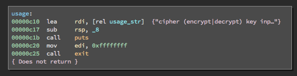
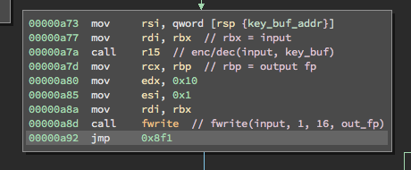
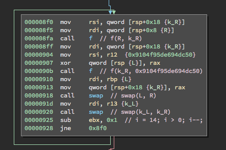
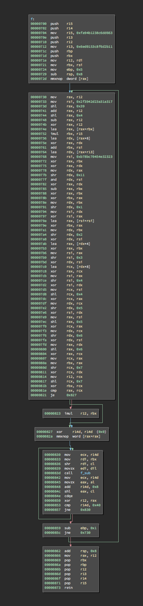
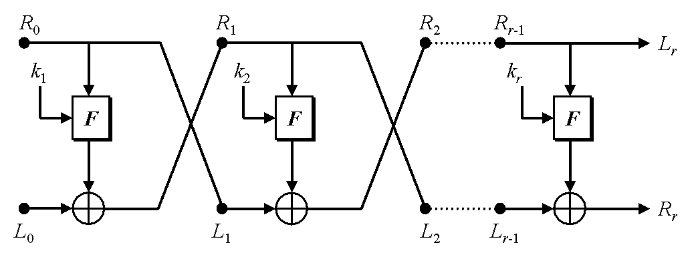

# Lost Decryption Writeup
### SECCON Quals 2016 – crypto/rev200

Adam Van Prooyen [website](http://van.prooyen.com/reversing/cryptography/2016/12/11/Lost-Decryption-Writeup.html)

> I created my own cipher and encrypted the very important file. However, I lost the decryption program because of file system error, so now I cannot read the file. Please help me

This challenge included a cipher binary, libencrypt.so, key.bin, and flag.enc. I thought this challenge was really fun because it mixed reverse engineering and basic block cryptography.

The first thing I did was to try and run it to see what it did. Unfortunately, the binary is missing the libdecrypt.so, so I was unable to get it running properly. Static analysis it is!

## cipher binary

Throwing the cipher binary into Binary Ninja, I found that this program itself was pretty straightforward aside from mostly using registers instead of the stack for variable storage. The usage function was particularly helpful:



> ./cipher (encrypt&#124;decrypt) key input output]

With this knowledge, I was able to figure out what files were being opened. After loading in the input file and the key, the binary enters a loop where the input is encrypted or decrypted 16 bytes at a time and incrementally written to the output file:



## libencrypt.so

When I felt like I had an good understanding of how cipher functioned, I decided it was time to figure out how the encryption itself worked. Opening libencrypt.so, I found that the encrypt function was very compact.

On a high level, encrypt separates the 16 byte input and key into two 8 byte chunks L, R and k_L, k_R respectively. Then, L is xored against f(R, k_R) and k_R is set to f(k_R, 0x9104f95de694dc50). Finally, L and R along with k_L and k_R are swapped. This is repeated 14 times.

{:style="max-height: 300px; width: auto;"}

The function f was not too long either. However, it consisted mostly of confusing, low-level bitwise arithmetic intended to mix its arguments: 

{:style="max-height: 400px; width: auto;"}

In addition, it relies on a recursive subroutine that does similar bit mixing operations:

{:style="max-height: 400px; width: auto;"}

## Feistel networks

While I usually have nothing better to do with my time than invert nonsensical functions, there is an easier way to deal with decryption. It turns out that the this encryption algorithm is almost a textbook feistel network implementation, the same kind of construction used by DES.

[Feistel networks](https://en.wikipedia.org/wiki/Feistel_cipher#Construction_details) have the nice property that for any round function, in this case f, one can easily invert (i.e. decrypt) the whole network without having to invert the round function.

[](http://crypto.stackexchange.com/questions/1352/are-there-any-specific-requirements-for-the-function-f-in-a-feistel-cipher)

The encryption and decryption algorithms are identical except that the order of the keys (called the key schedule) is reversed. And since feistel networks are symmetric cryptographic algorithms, the key used for encryption is also used for decryption.

## Decryption

Now that I had identified the encryption scheme, I needed to implement the decryption algorithm. For this, I was going to need to be able to call f and there is no way I was going to reimplement it by hand. 

Since Python [ctypes](https://docs.python.org/2.7/library/ctypes.html) was giving me a hard time, I just decided to just mmap libencrypt.so into a C program and call f directly. This ended up working better than I expected and I am probably going to use this technique more in the future.

``` c
fd = open("libencrypt.so", O_RDWR);
fstat(fd, &st);
libencrypt = mmap(NULL, st.st_size, PROT_EXEC, MAP_PRIVATE, fd, 0);
f = (uint64_t (*)(uint64_t, uint64_t)) &libencrypt[0x700];
```

Because decryption requires the key schedule to be applied in reverse order, I needed to start the feistel network with the last key. Since there is no way to generate the last sub-key on the spot or generate a previous key, I calculated all sub-keys at once and stored them in reverse order:

``` c
void gen_keys(uint64_t k_L, uint64_t k_R) {
    int i;

    for (i = 0; i < ROUNDS; i++) {
        keys[ROUNDS - i - 1] = k_R;
        k_R = f(k_R, c);
        swap(&k_L, &k_R);
    }
}
```

Now that I had the decryption key schedule and the ciphertext, I just needed to run through the feistel network on a 16 byte piece of the ciphertext:

``` c
void decrypt(char *ct) {
    uint64_t k_n, L, R;
    int i;

    L = *(uint64_t *) ct;
    R = *((uint64_t *) ct + 1);
    for (i = 0; i < ROUNDS; i++) {
        k_n = keys[i];
        L ^= f(R, k_n);
        swap(&L, &R);
    }
    *(uint64_t *) ct = L;
    *((uint64_t *) ct + 1) = R;
}
```

Running the decrypt function on the whole ciphertext yields the flag:

``` c
for (i = 0; i < 3; i++) {
    decrypt(&ct[i * 16]);
}
printf("%s\n", ct);
```

> Flag: SECCON{Decryption_Of_Feistel_is_EASY!}

## Downloads
[lost.c](lost.c)  
[lost_decryption.zip](lost_decryption.zip)