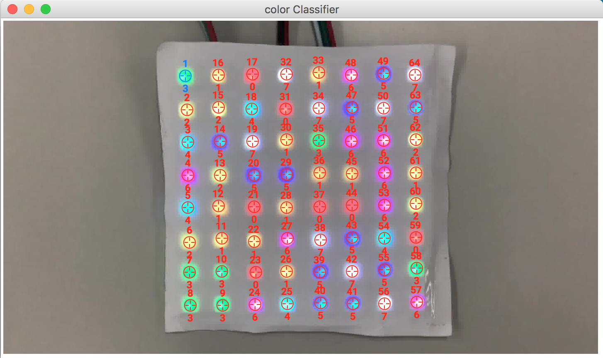

# Matrix LED — Miscellaneous Challenge — Writeup by Matthew Savage, Artemis Tosini, and Robert Xiao

## Description

A program sends a secret key and a flag "jpeg" to an Arduino connected to a WS2812B led matrix. A program on the Arduino encrypts the data and prints it out the data with a custom encoding onto the LED matrix. We recieve the Arduino binary, a Python program that was used to send the flag to the Arduino, a video of the LED matrix, and pictures of the circuit.

## Solution

We started by trying to decode the video. Luckily, the video did not move, so we did not have to do any tracking. Our first method involved decoding each frame by selecting several LEDs in each pixel and attempting to find the best color by the closest RGB value. However, this had trouble discerning between yellow and orange. While the error correction in the encoing may have been able to deal with this, we decided to use a more accurate method.

To improve accuracy, we were able to retool some of the testing tools written for the PlaidCTF 2018 problem ["idIoT: Lights"](https://ctftime.org/task/6149).  In order to test the intended exploit efficiently (which involved leaking a private key via an LED strip), we wrote a script that did almost this exact task: took a sequence of LED colors and converted it back to the underlying data.  To facilitate this, our script allows the user to select the positions of LEDs in the image, and then label color index each should be classified as.  On subsequent frames LEDs are automatically labeled by a simple KNN classifier, and the output data can be corrected to produce more training data; through this process it's easy to get a few hundred training samples in just a couple of minutes.  The script dumps this data to a CSV, which can be processed by a companion script to hand the data to [Weka](https://www.cs.waikato.ac.nz/ml/weka/) to produce a J48 decision tree, which is then converted into Python code that can be pasted back into the tool.  When started in another mode, the tool will simply read all of the frames and will classify each LED using the provided model in order to output the final data.



_A picture of the model training interface.  You can find the source for this tool in the `decoder` directory._

The modified copy of the script makes a couple of improvements over a naive appraoch in order to improve accuracy:

- The color in the center of an LED is usually not captured well by cameras, so we actually average the pixels in a ring around the center rather than looking at the center itself.

- We also include hue and brightness in addition to raw R, G, and B values in the training data since they are physically meaningful but too complex to be captured by the J48 tree.

- The camera's brightness is extremely variable while and shortly after the LEDs are switching color, often leading to bad frames; to combat this, we wait two frames after detecting a change before reading more data.

In the end, we found an extremely simple decision tree that had 99.8% accuracy on our training data (and, we later found out, similar performance across the entire dataset):

```
J48 pruned tree
------------------

blue <= 0.844118
|   brightness <= 0.002659
|   |   green <= 0.702083: 0 (98.0)
|   |   green > 0.702083: 3 (67.0)
|   brightness > 0.002659
|   |   hue <= 2.435594: 1 (54.0)
|   |   hue > 2.435594: 2 (103.0)
blue > 0.844118
|   red <= 0.568995
|   |   green <= 0.784926: 5 (79.0/1.0)
|   |   green > 0.784926: 4 (63.0)
|   red > 0.568995
|   |   green <= 0.703431: 6 (63.0)
|   |   green > 0.703431: 7 (73.0)

[...]

=== Error on training data ===

Correctly Classified Instances         599               99.8333 %
Incorrectly Classified Instances         1                0.1667 %
Kappa statistic                          0.9981
Mean absolute error                      0.0008
Root mean squared error                  0.0203
Relative absolute error                  0.3786 %
Root relative squared error              6.1536 %
Total Number of Instances              600

[...]

=== Confusion Matrix ===

   a   b   c   d   e   f   g   h   <-- classified as
  98   0   0   0   0   0   0   0 |   a = 0
   0  54   0   0   0   0   0   0 |   b = 1
   0   0 103   0   0   0   0   0 |   c = 2
   0   0   0  67   0   0   0   0 |   d = 3
   0   0   0   0  63   0   0   0 |   e = 4
   0   0   0   0   0  78   0   0 |   f = 5
   0   0   0   0   0   0  63   0 |   g = 6
   0   0   0   0   0   1   0  73 |   h = 7
```

(Note: in our format, `0 <= red, green, blue, brightness <= 1` and `0 <= hue < 16`.)

To get a file containing all the pixel values, we downloaded the video with youtube-dl then used ffmpeg to split the video into PNG frames with one for each change of the matrix. We then ran our improved script on the frames.

Meanwhile, we reverse engineered the provided binary to figure out how the data was encoded onto the LEDs. As a first pass, we compiled an Arduino program for the same device (LinkIt Smart 7688 Duo) and found that many of the functions matched, allowing us to quickly recover most of the MatrixLED binary's structure.

The LED Matrix program displays 16 bytes at a time on the matrix. The first frame it displays is a random 16-byte "key" sent by the host Python program, after which it sends 16-byte chunks of the flag file encrypted using that key. We found many constants in the binary relating to the encryption algorithm, but searching online for those constants turned up nothing. This suggests that the algorithm was either custom, or a modified version of an existing algorithm. Unfortunately, this meant that we had to fully reverse engineer the cryptography, which took quite some time. The resulting algorithm is reconstructed in [mycrypt.py](mycrypt.py) and [encrypt.c](encrypt.c).

The processed 16-byte chunks are prepared for display by appending an 8 byte Reed-Solomon error-correcting code, providing some measure of resilience against bad decodings. The full 24-byte message is then chunked into 64 3-bit units, each of which is coded as one of 8 colors on the LED matrix. A full decode script is provided in [decodebin.py](decodebin.py).

Finally, we reconstructed the file. Unfortunately, it didn't look like a JPEG and binwalk turned up nothing. We asked the organizers, and they posted the beginning and end of the file and a new flag format based on the MD5 of the full file - it seems they messed up and sent the wrong file. The first frame provided by the organizers also did not match what we had, but luckily replacing that frame in our data yielded a correct flag.
