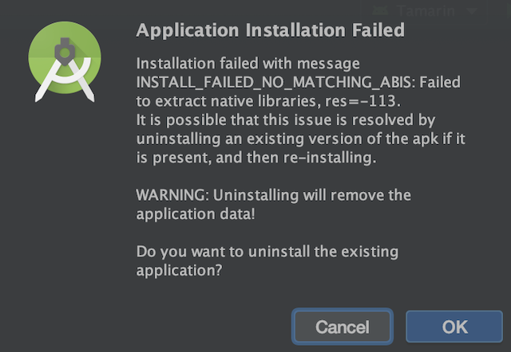
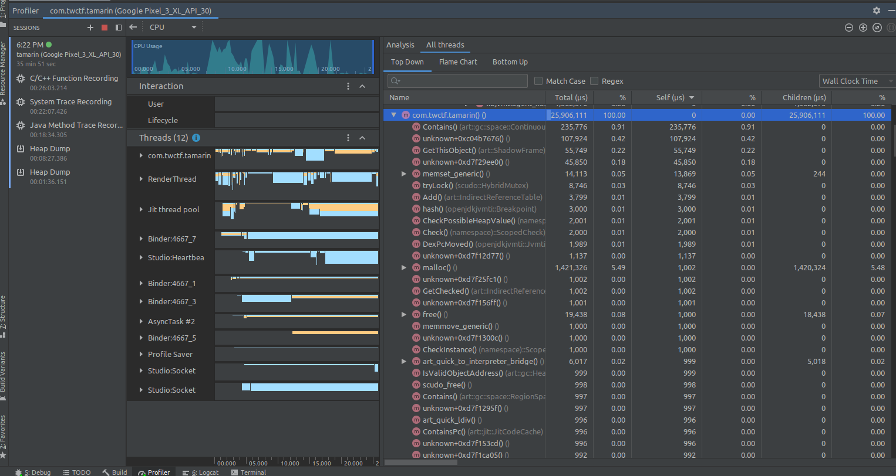
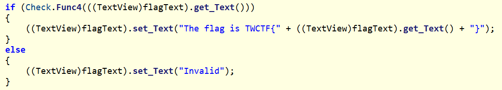
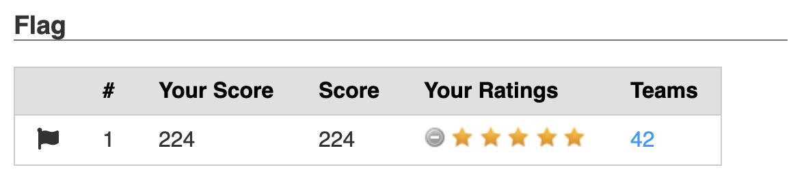

# Tamarin
[](https://shields.io/)

## Problem

[Tamarin.7z](./Tamarin.7z)

## Files

* [Tamarin.7z](./Tamarin.7z) - Provided 7z file
  - [Tamarin.apk](./Tamarin.apk) - Challenge APK
* [source/](./source) - Source code recovered with mono_unbundle and ILSpy
* [Solver.cs](./Solver.cs) - Flag derivation script

## Solution

### Emulation

`7z x Tamarin.7z` extracts the only provided file: `Tamarin.apk`. Usually importing an APK into Android Studio and running it in an emulator is no problem, but in this case it required some extra steps. Attempting to run it resulted in this message:

<div align="center"></div>

It seems the app was "ahead-of-time" (AOT) compiled for use only on the 32-bit Arm architecture.

This question on Stack Overflow addresses the error: https://stackoverflow.com/q/24572052. We need to create a new emulator with the ABI `armeabi-v7a`. Unfortunately, using this ABI on an x86 host is incredibly slow. I couldn't get the emulator to boot in a reasonable amount of time and the app was not usable. 

After doing some digging, I found this post: https://android-developers.googleblog.com/2020/03/run-arm-apps-on-android-emulator.html

> The new Android 11 system images are capable of translating ARM instructions to x86 without impacting the entire system. This allows the execution of ARM binaries for testing without the performance overhead of full ARM emulation.

So I downloaded the Android 11 developer preview, made a new emulator with an updated SDK and system image, and imported the APK:

<div align="center"></div>

Submitting text changes the text to `Invalid`, suggesting that the goal of this challenge is to reverse engineer whatever validation function is checking input to recover the flag.

### Decompilation

Now that the app's behavior is known, the validation function needs to be analyzed. Android Studio shows a `java` folder that doesn't contain anything interesting besides `mono` and `xamarin.android` directories. Xamarin and Mono are both .NET technologies, so the source of the program likely is not written in Java. The `cpp` directory is much more interesting. It contains many `.dll.so` files, one is named `libaot-Tamarin.dll.so`:

```
$ file libaot-Tamarin.dll.so
libaot-Tamarin.dll.so: ELF 32-bit LSB shared object, ARM, EABI5 version 1 (SYSV), dynamically linked, stripped
```

I was hopeful at this point and loaded it into Ghidra for analysis. After playing with it and trying the *ARM Aggressive Instruction Finder*, I still couldn't make sense of the disassembly/decompilation. However, it did seem like the validation function was in this file. 

Another team member inspecting the disassembly was able to pull out some general behaviors, such as the recursive function being called in a loop 10,000 times, but it was not possible to elaborate on the exact behavior of the functions because they heavily depended on external calls determined at runtime. 

The next thing I tried was the Android Studio debugger. Tracing the Java/CPP calls worked while entering text, but whenever I would submit text to the app it would crash. Another team member did not have this trouble with Android Studio. After setting debug to true in the manifest file and repackaging the .apk, they found that the debugger was of limited help, however, as heap dumps did not contain any flags, method and syscall traces lacked much information, and C/C++ function call tracing was not very enlightening without debug symbols.

<div align="center"></div>

Eventually, I came across this post https://stackoverflow.com/questions/44097544/decompile-apk-built-with-xamarin/51760141 that suggested https://github.com/tjg1/mono_unbundle. 

```
apktool d Tamarin.apk
mono_unbundle Tamarin/lib/armeabi-v7a/libmonodroid_bundle_app.so dlls/
```

Once the original DLLs have been extracted, they can be decompiled with a tool like https://github.com/icsharpcode/ILSpy. This tool perfectly decompiled `Tamarin.dll`!

<div align="center"></div>

### Understanding The Source

The source has been recovered. At this point it should be straightforward to figure out what's going on.

#### `Func4()` Walkthrough
1. The input text is passed to `Func4()` to be validated.
```cs
if (Check.Func4(((TextView)flagText).get_Text()))
{
  ((TextView)flagText).set_Text("The flag is TWCTF{" + ((TextView)flagText).get_Text() + "}");
}
```

2. `Func4()` verifies that the length of the input string is 88
```cs
// equations_arr.GetLength(0) is 22, 22 * 4 == 88
if (array.Length != equations_arr.GetLength(0) * 4)
{
  return false;
}
```

3. 22 lists are constructed, each with 33 elements. The first element of each list is always a concatenation of the input bytes. For instance, `p@$$w0rd...` would turn into `list[0][0] = p@$$.ToUInt32(); list[1][0] = w0rd.ToUInt32();`. The next 32 elements come from a pre-defined array of integers called `equations_arr`
```cs
// go through loop 22 times
for (int j = 0; j < equations_arr.GetLength(0); j++)
{
  // new list
  List<uint> list2 = new List<uint>();
  // create uint from four input characters
  list2.Add(BitConverter.ToUInt32(array, j * 4));
  // copy remaining elements from equations_arr
  for (int k = 0; k < equations_arr.GetLength(1); k++)
  {
    list2.Add(equations_arr[j, k]);
  }
  list.Add(list2);
}
```

4. Each list is sent through `Func2()` with a random number 1000 times. After a certain number of iterations, the random number stabilizes to a deterministic value that depends on the input string. This was determined by setting the loop max to different high values (>30) and observing no change in the final `num`. Once the value settles, it is compared with the last element of the list. If the last element of every list matches its stabilized value from `Func2()`, the flag is correct
```cs
// Parallelize the processing of each list
Parallel.ForEach(list, parallelOptions, delegate(List<uint> equation)
{
  lock (lockObj)
  {
    // random number generation
    uint num = Func3();
    // Stabilize num through many iterations of Func2()
    for (int l = 0; l < 10000; l++)
    {
      // arguments are list, num, and list.Count - 2 (33 - 2 == 31)
      num = Func2(equation, num, equation.Count - 2);
    }
    // compare stabilized value with last value of list (equation[32])
    checkResults.Add(num == equation[equation.Count - 1]);
  }  
});
// all checks must pass for this to be the flag
return checkResults.ToArray().All((bool x) => x);
```

All of the interesting stuff is happening in `Func2()`, let's take a look.

#### `Func2()` And `Func1()` Walkthrough

This function multiplies a value in the input list with the output of `Func1()` and adds it to the recursive call of `Func2()` with coefficent index subtracted by one. 
```cs
private static uint Func2(List<uint> coefficients, uint x, int pos)
{
  // base case
  if (pos == -1)
  {
    return 0u;
  }
  uint num = coefficients[pos] * Func1(x, pos);
  return num + Func2(coefficients, x, pos - 1);
}
```

We need to know what `Func1()` is doing to make sense of this. Luckily it's just a `pow` function!

```cs
private static uint Func1(uint x, int n)
{
  // raise x to the nth power
  uint num = 1u;
  for (int i = 0; i < n; i++)
  {
    num *= x;
  }
  return num;
}
```

This is enough information to turn `Func2()` into a readable equation:

`Func2(coefficients, x, pos) = coefficients[pos] * x^pos + coefficients[pos-1] * x^pos-1 + ... coefficients[0] * x^0`

### Deriving The Flag

We know that `num` starts off as a randomly generated number that stabilizes over time. This number will be equal to the last value in the list. Let's plug the numbers we know into the `Func2()` equation, taking the first list as an example. Since the number stabilizes, we know that after some number of iterations the input `num` and output `num` are the same which is critical for solving this equation:

```
Func2(list, num, pos) = list[pos] * num^pos + list[pos-1] * num^pos-1 + ... coefficients[1] * num^1 + coefficients[0] * num^0
Func2(first_list, 3903653528u, 31) = 3695085832u*3903653528u^31 + 3485949926u*3903653528u^30 + ... + 2921822136u*3903653528u + first_four_flag_chars*1
3903653528u = 3695085832u*3903653528u^31 + 3485949926u*3903653528u^30 + ... + 2921822136u*3903653528u + first_four_flag_chars*1
3903653528u - (3695085832u*3903653528u^31 + 3485949926u*3903653528u^30 + ... + 2921822136u*3903653528u) =  first_four_flag_chars
```

Solving for the left-hand side of this equation gives the first four flag characters! I modified the code a little bit to do this for every list and convert the integers back into characters. This was the result:

`TWCTF{Xm4r1n_15_4bl3_70_6en3r4t3_N471v3_C0d3_w17h_VS_3n73rpr153_bu7_17_c0n741n5_D07_N3t_B1n4ry}`

<div align="center"></div>

#### Write-Up Author: @luker983 with additions from @cpt_armerica
#### Solution Contributors: @luker983 @cpt_armerica @madStacks
